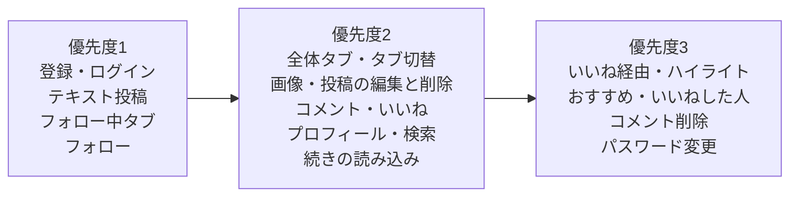

# 機能一覧：タイムライン型 SNS（RaiseTimeline）

| 項目 | 内容 |
|---|---|
| 文書番号 | 01-1 |
| 版数 | 0.5 |
| 作成日 | 2026-10-07 |
| 作成者 | major182 |
| 前提となる文書 | [01 要件定義書](01_requirements.md) |

---

## 1. この文書の目的

[01 要件定義書](01_requirements.md) の要件を、**どの機能・どの画面で満たすか**に分けて一覧にする。
設計書・Issue・テスト仕様書からは、この文書の機能 ID（`F-xx-nn`）で参照する。

### 優先度

| 優先度 | 意味 |
|---|---|
| 1 | 他の機能の土台になるもの。最初に作る |
| 2 | 主な機能。1 の後に作る |
| 3 | 1・2 がそろってから作るもの |

本書の機能はすべて**必須**とする。優先度は作る順番を表し、取捨選択には使わない。

---

## 2. 機能の一覧

### 2.1 認証（F-AU）

| ID | 機能 | 内容 | 画面 | 業務ルール | 優先度 |
|---|---|---|---|---|---|
| F-AU-01 | 利用者登録 | ユーザー名・メールアドレス・パスワード・パスワード（確認）で登録する。表示名は最初はユーザー名と同じにする。登録後はそのままログインした状態になる | 利用者登録 | BR-01〜05、BR-09 | 1 |
| F-AU-02 | ログイン | メールアドレスとパスワードでログインする。続けて失敗したら一時的に止める | ログイン | BR-04、BR-07、BR-08 | 1 |
| F-AU-03 | ログアウト | ログインの状態をすぐに無効にする | 設定 | BR-07 | 1 |
| F-AU-04 | ログインしていない人の制限 | ログイン・利用者登録以外の画面と API を、ログインしていない人に見せない | ― | BR-06 | 1 |
| F-AU-05 | パスワードの変更 | 今のパスワードを確かめてから、新しいパスワードにする | 設定 | BR-05 | 3 |
| F-AU-06 | 入力の誤りの表示 | 登録・ログインで誤りがあれば、入力欄の近くに理由を表示する。ログインの失敗は、メールアドレスとパスワードのどちらが違うかを区別せずに表示する | 利用者登録、ログイン | BR-09 | 1 |

### 2.2 利用者・プロフィール（F-US）

| ID | 機能 | 内容 | 画面 | 業務ルール | 優先度 |
|---|---|---|---|---|---|
| F-US-01 | プロフィールの表示 | アイコン・表示名・ユーザー名・自己紹介・フォロー数・フォロワー数と、その利用者の投稿一覧を表示する。自分なら「プロフィールを編集」、他人なら「フォロー／フォロー中」のボタンを出す | プロフィール | BR-44 | 2 |
| F-US-02 | プロフィールの編集 | アイコン・表示名・ユーザー名・自己紹介（160 文字）を変更する | プロフィールの編集 | BR-02、BR-03、BR-24、BR-25 | 2 |
| F-US-03 | 利用者の検索 | ユーザー名・表示名の部分一致で、大文字・小文字を区別せずに検索する。20 件ずつ表示する（候補 A） | 利用者の検索 | ― | 2 |
| F-US-04 | おすすめの利用者 | フォローしている人がフォローしている人を表示する。いなければ最近登録した人を表示する（候補 C） | 利用者の検索、タイムライン（横の欄） | ― | 3 |

候補 B（投稿・コメント・一覧からプロフィールへの移動）は、利用者名やアイコンを表示する全画面の共通の動きとして作る。
候補の比較は [01 要件定義書 4.1](01_requirements.md#41-他の利用者の探し方候補) を参照する（A + B + C に決定済み。Q-01）。

### 2.3 投稿（F-PO）

| ID | 機能 | 内容 | 画面 | 業務ルール | 優先度 |
|---|---|---|---|---|---|
| F-PO-01 | テキストの投稿 | 280 文字までのテキストを投稿する。入力中に文字数のカウンターを表示し、超えたら投稿できなくする | 投稿作成モーダル | BR-10、BR-11 | 1 |
| F-PO-02 | 画像の投稿 | 投稿に画像を 4 枚まで添付する。送る前にプレビューを表示し、外せる | 投稿作成モーダル | BR-11、BR-20〜23 | 2 |
| F-PO-03 | 投稿の削除 | 自分の投稿だけ、削除確認ダイアログで確認してから削除する。コメント・いいね・画像も消す | タイムライン、投稿の詳細、削除確認ダイアログ | BR-12、BR-13 | 2 |
| F-PO-04 | 投稿の詳細 | 投稿の全文と、そのコメントの一覧・コメントの入力欄を表示する | 投稿の詳細 | ― | 2 |
| F-PO-05 | 画像の拡大表示 | 画像を押すと大きく表示する | タイムライン、投稿の詳細 | ― | 3 |
| F-PO-06 | 投稿の編集 | 自分の投稿だけ、本文（テキスト）を変更する。文字数のカウンターを表示する。編集後は「編集済み」と表示する | 投稿編集モーダル | BR-12、BR-15、BR-16 | 2 |

### 2.4 タイムライン（F-TL）

| ID | 機能 | 内容 | 画面 | 業務ルール | 優先度 |
|---|---|---|---|---|---|
| F-TL-01 | フォロー中タブ | 自分とフォロー中の人の投稿を、新しい順に 20 件ずつ表示する | タイムライン | BR-50、BR-50-2 | 1 |
| F-TL-02 | 続きの読み込み | 下までスクロールしたら、続きの 20 件を読み込む。重複・欠落させない | タイムライン、プロフィール | BR-53 | 2 |
| F-TL-03 | 利用者ごとの投稿一覧 | ある利用者の投稿だけを新しい順に表示する | プロフィール | BR-53 | 2 |
| F-TL-04 | 最新の表示 | 更新の操作で、一覧を読み込み直す | タイムライン | BR-54 | 2 |
| F-TL-05 | 全体タブ | 全員の投稿を、新しい順に 20 件ずつ表示する | タイムライン | BR-50、BR-50-1 | 2 |
| F-TL-06 | 全体／フォロー中のタブ切替 | 一覧の上のタブで切り替える。最初はフォロー中。選んだ方を端末ごとに覚える | タイムライン | BR-51 | 2 |
| F-TL-07 | いいね経由の投稿 | フォロー中タブに、フォロー中の人がいいねした、フォローしていない人の投稿を「○○さんがいいねしました」と添えて混ぜる | タイムライン | BR-50-3 | 3 |
| F-TL-08 | 留守中のハイライト | フォロー中タブを 6 時間以上あいて開いたとき、その間の反応の多いフォロー中の投稿を最大 3 件、一番上にまとめて出す | タイムライン | BR-52、BR-55 | 3 |

各投稿（投稿カード）には、**アイコン・表示名・ユーザー名・本文・画像・投稿日時・「編集済み」の印・いいねの数・コメントの数**を表示する。自分の投稿にだけ、編集・削除のボタンを表示する。**インプレッション数とリツイートの操作は表示しない**（BR-40、BR-41）。

いいね経由の投稿・ハイライトはいいね（F-LK）の上に成り立つため、優先度を 3 にしている。

### 2.5 コメント（F-CM）

| ID | 機能 | 内容 | 画面 | 業務ルール | 優先度 |
|---|---|---|---|---|---|
| F-CM-01 | コメントの投稿 | 投稿に 280 文字までのコメントをつける | 投稿の詳細 | BR-30 | 2 |
| F-CM-02 | コメントの一覧 | 投稿についたコメントを古い順に表示する | 投稿の詳細 | ― | 2 |
| F-CM-03 | コメントの数の表示 | 投稿ごとにコメントの数を表示する | タイムライン、投稿の詳細 | BR-31 | 2 |
| F-CM-04 | コメントの削除 | コメントした本人か、投稿した本人が、削除確認ダイアログで確認してから削除する | 投稿の詳細、削除確認ダイアログ | BR-35 | 3 |

### 2.6 いいね（F-LK）

| ID | 機能 | 内容 | 画面 | 業務ルール | 優先度 |
|---|---|---|---|---|---|
| F-LK-01 | いいね・取り消し | 投稿にいいねする。もう一度押すと取り消す。押したらすぐ画面に反映する | タイムライン、投稿の詳細 | BR-33、BR-34 | 2 |
| F-LK-02 | いいねの数の表示 | 投稿ごとにいいねの数と、自分がいいね済みかを表示する | タイムライン、投稿の詳細 | BR-32 | 2 |
| F-LK-03 | いいねした人の一覧 | 投稿にいいねした利用者を一覧にする | いいねした人の一覧 | BR-32 | 3 |

### 2.7 フォロー（F-FL）

| ID | 機能 | 内容 | 画面 | 業務ルール | 優先度 |
|---|---|---|---|---|---|
| F-FL-01 | フォロー・解除 | プロフィールや一覧から、フォロー・解除する | プロフィール、利用者の検索、各一覧 | BR-42、BR-43 | 1 |
| F-FL-02 | フォローの一覧 | ある利用者がフォローしている人を一覧にする | フォロー／フォロワー一覧（フォロータブ） | BR-44 | 2 |
| F-FL-03 | フォロワーの一覧 | ある利用者をフォローしている人を一覧にする | フォロー／フォロワー一覧（フォロワータブ） | BR-44 | 2 |
| F-FL-04 | フォロー数・フォロワー数の表示 | プロフィールに数を表示する。押すと一覧の該当タブを開く | プロフィール | BR-44 | 2 |

---

## 3. 画面の一覧

| No | 画面 | 種類 | ログイン | 主な要素 | 主な機能 |
|---|---|---|---|---|---|
| 1 | ログイン | 画面 | 不要 | メールアドレス・パスワードの入力欄、エラーの表示 | F-AU-02、F-AU-06 |
| 2 | 利用者登録 | 画面 | 不要 | メールアドレス・パスワード・パスワード（確認）・ユーザー名の入力欄、入力の誤りの表示 | F-AU-01、F-AU-06 |
| 3 | タイムライン（ホーム） | 画面 | 必要 | 全体／フォロー中のタブ、投稿カードの一覧（いいねの数・コメントの数、自分の投稿に編集・削除のボタン）、投稿ボタン | F-TL-01、F-TL-02、F-TL-04〜08、F-LK-01、F-LK-02、F-CM-03、F-US-04 |
| 3-1 | 投稿作成モーダル | モーダル | 必要 | テキストの入力欄（280 文字のカウンター）、画像の添付とプレビュー | F-PO-01、F-PO-02 |
| 3-2 | 投稿編集モーダル | モーダル | 必要（投稿した本人だけ） | 今の本文が入ったテキストの入力欄、文字数のカウンター | F-PO-06 |
| 3-3 | 削除確認ダイアログ | ダイアログ | 必要 | 確認のメッセージ、「キャンセル」「削除」のボタン | F-PO-03、F-CM-04 |
| 4 | 投稿の詳細 | 画面 | 必要 | 投稿の全文、コメントの一覧、コメントの入力欄 | F-PO-03〜05、F-CM-01〜04、F-LK-01、F-LK-02 |
| 5 | プロフィール | 画面 | 必要 | アイコン・表示名・ユーザー名・自己紹介・フォロー数・フォロワー数、フォローボタンか編集ボタン、その利用者の投稿一覧 | F-US-01、F-TL-03、F-FL-01、F-FL-04 |
| 6 | プロフィールの編集 | 画面 | 必要 | アイコンの変更、表示名・ユーザー名・自己紹介（160 文字）の入力欄 | F-US-02 |
| 7 | 利用者の検索 | 画面 | 必要 | 検索の入力欄、結果の一覧、おすすめの利用者 | F-US-03、F-US-04、F-FL-01 |
| 8 | フォロー／フォロワー一覧 | 画面 | 必要 | フォロー／フォロワーのタブ、利用者の一覧 | F-FL-01〜03 |
| 9 | いいねした人の一覧 | 画面 | 必要 | 利用者の一覧 | F-LK-03 |
| 10 | 設定 | 画面 | 必要 | ログアウト、パスワードの変更 | F-AU-03、F-AU-05 |

- 投稿作成・投稿編集のモーダルと削除確認ダイアログは、開いた元の画面の上に重ねて表示する。閉じたら元の画面に戻る
- 入力の誤りは、送信したときに入力欄の近くに表示する。サーバーでも同じチェックをする（画面だけのチェックに頼らない）

---

## 4. 作る順番

---

## 5. 改訂履歴

| 版数 | 日付 | 内容 |
|---|---|---|
| 0.1 | 2026-10-07 | 初版 |
| 0.2 | 2026-10-07 | 投稿の編集（F-PO-06）と画面「投稿の編集」を追加。ホームのタイムラインを、フォロー中を優先した全員の投稿の一覧に変更。利用者の探し方を A + B + C に決定 |
| 0.3 | 2026-10-07 | ホームのタイムラインを2010年代後半の Twitter に近い形に変更（F-TL-01 を「最新」に、F-TL-05〜08 を追加） |
| 0.4 | 2026-10-09 | 画面ごとの機能要件を反映。タイムラインを全体／フォロー中のタブに変更（F-TL-01・05〜08）。280 文字に変更。ユーザー名を変更可能に（F-US-02）。投稿の編集をテキストだけに（F-PO-06）。入力の誤りの表示（F-AU-06）、投稿作成・編集のモーダル、削除確認ダイアログ、フォロー／フォロワー一覧のタブを追加。画面の一覧に種類と主な要素の列を追加 |
| 0.5 | 2026-10-10 | F-AU-03 ログアウトの画面を、画面の一覧・画面設計書（SC-10）に合わせて「設定」に直した |
