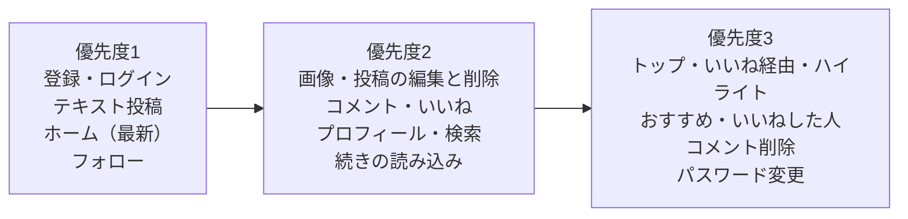

# 機能一覧：タイムライン型 SNS（RaiseTimeline）

| 項目 | 内容 |
|---|---|
| 文書番号 | 01-1 |
| 版数 | 0.3 |
| 作成日 | 2026-10-07 |
| 作成者 | major182 |
| 前提となる文書 | [01 要件定義書](01_requirements.md) |

---

## 1. この文書の目的

[01 要件定義書](01_requirements.md) の要件を、**どの機能・どの画面で満たすか**に分けて一覧にする。
設計書・Issue・テスト仕様書からは、この文書の機能 ID（`F-xx-nn`）で参照する。

### 優先度

| 優先度 | 意味 |
|---|---|
| 1 | 他の機能の土台になるもの。最初に作る |
| 2 | 主な機能。1 の後に作る |
| 3 | 1・2 がそろってから作るもの |

本書の機能はすべて**必須**とする。優先度は作る順番を表し、取捨選択には使わない。

---

## 2. 機能の一覧

### 2.1 認証（F-AU）

| ID | 機能 | 内容 | 画面 | 業務ルール | 優先度 |
|---|---|---|---|---|---|
| F-AU-01 | 利用者登録 | ユーザー ID・表示名・メールアドレス・パスワードで登録する。登録後はそのままログインした状態になる | 利用者登録 | BR-01〜05 | 1 |
| F-AU-02 | ログイン | メールアドレスとパスワードでログインする。続けて失敗したら一時的に止める | ログイン | BR-04、BR-07、BR-08 | 1 |
| F-AU-03 | ログアウト | ログインの状態をすぐに無効にする | 共通（メニュー） | BR-07 | 1 |
| F-AU-04 | ログインしていない人の制限 | ログイン・利用者登録以外の画面と API を、ログインしていない人に見せない | ― | BR-06 | 1 |
| F-AU-05 | パスワードの変更 | 今のパスワードを確かめてから、新しいパスワードにする | 設定 | BR-05 | 3 |

### 2.2 利用者・プロフィール（F-US）

| ID | 機能 | 内容 | 画面 | 業務ルール | 優先度 |
|---|---|---|---|---|---|
| F-US-01 | プロフィールの表示 | 表示名・ユーザー ID・自己紹介・アイコン・登録日・フォロー数・フォロワー数を表示する | プロフィール | BR-44 | 2 |
| F-US-02 | プロフィールの編集 | 表示名・自己紹介・アイコンを変更する（ユーザー ID は変えられない） | プロフィールの編集 | BR-02、BR-03、BR-24 | 2 |
| F-US-03 | 利用者の検索 | ユーザー ID・表示名の部分一致で、大文字・小文字を区別せずに検索する。20 件ずつ表示する（候補 A） | 検索 | ― | 2 |
| F-US-04 | おすすめの利用者 | フォローしている人がフォローしている人を表示する。いなければ最近登録した人を表示する（候補 C） | 検索、ホーム（横の欄） | ― | 3 |

候補 B（投稿・コメント・一覧からプロフィールへの移動）は、利用者名やアイコンを表示する全画面の共通の動きとして作る。
候補の比較は [01 要件定義書 4.1](01_requirements.md#41-他の利用者の探し方候補) を参照する（A + B + C に決定済み。Q-01）。

### 2.3 投稿（F-PO）

| ID | 機能 | 内容 | 画面 | 業務ルール | 優先度 |
|---|---|---|---|---|---|
| F-PO-01 | テキストの投稿 | 140 文字までのテキストを投稿する。入力中に残りの文字数を表示する | ホーム（投稿欄） | BR-10、BR-11 | 1 |
| F-PO-02 | 画像の投稿 | 投稿に画像を 4 枚まで添付する。送る前にプレビューを表示し、外せる | ホーム（投稿欄） | BR-11、BR-20〜23 | 2 |
| F-PO-03 | 投稿の削除 | 自分の投稿だけ、確認してから削除する。コメント・いいね・画像も消す | タイムライン、投稿の詳細 | BR-12、BR-13 | 2 |
| F-PO-04 | 投稿の詳細 | 1件の投稿と、そのコメントの一覧を表示する | 投稿の詳細 | ― | 2 |
| F-PO-05 | 画像の拡大表示 | 画像を押すと大きく表示する | タイムライン、投稿の詳細 | ― | 3 |
| F-PO-06 | 投稿の編集 | 自分の投稿だけ、本文と画像を変更する。編集後は「編集済み」と表示する | 投稿の編集 | BR-12、BR-15、BR-16 | 2 |

### 2.4 タイムライン（F-TL）

| ID | 機能 | 内容 | 画面 | 業務ルール | 優先度 |
|---|---|---|---|---|---|
| F-TL-01 | ホームのタイムライン（最新） | 自分とフォロー中の人の投稿を、新しい順に 20 件ずつ表示する | ホーム | BR-50-1、BR-51-2 | 1 |
| F-TL-02 | 続きの読み込み | 下までスクロールしたら、続きの 20 件を読み込む。重複・欠落させない | ホーム、プロフィール | BR-53 | 2 |
| F-TL-03 | 利用者ごとの投稿一覧 | ある利用者の投稿だけを新しい順に表示する | プロフィール | BR-53 | 2 |
| F-TL-04 | 最新の表示 | 更新の操作で、一覧を読み込み直す | ホーム | BR-54 | 2 |
| F-TL-05 | ホームのタイムライン（トップ） | フォロー中の投稿といいね経由の投稿を、反応と新しさの点数順に並べる。72 時間より古いものは新しい順で続ける | ホーム | BR-50、BR-51-1 | 3 |
| F-TL-06 | トップ／最新の切り替え | 一覧の上のボタンで切り替える。最初はトップ。選んだ方を端末ごとに覚える | ホーム | BR-51 | 3 |
| F-TL-07 | いいね経由の投稿 | フォロー中の人がいいねした、フォローしていない人の投稿を「○○さんがいいねしました」と添えて出す（トップだけ） | ホーム | BR-50-2 | 3 |
| F-TL-08 | 留守中のハイライト | 6 時間以上あいて開いたとき、その間の反応の多いフォロー中の投稿を最大 3 件、一番上にまとめて出す | ホーム | BR-52、BR-55 | 3 |

各投稿には、**投稿者・本文・画像・投稿日時・「編集済み」の印・いいねの数・コメントの数**を表示する。自分の投稿にだけ、編集・削除の操作を表示する。

トップ・いいね経由の投稿・ハイライトはいいね（F-LK）の上に成り立つため、優先度を 3 にしている。それまでは「最新」だけで動かす。**インプレッション数とリツイートの操作は表示しない**（BR-40、BR-41）。

### 2.5 コメント（F-CM）

| ID | 機能 | 内容 | 画面 | 業務ルール | 優先度 |
|---|---|---|---|---|---|
| F-CM-01 | コメントの投稿 | 投稿に 140 文字までのコメントをつける | 投稿の詳細 | BR-30 | 2 |
| F-CM-02 | コメントの一覧 | 投稿についたコメントを古い順に表示する | 投稿の詳細 | ― | 2 |
| F-CM-03 | コメントの数の表示 | 投稿ごとにコメントの数を表示する | タイムライン、投稿の詳細 | BR-31 | 2 |
| F-CM-04 | コメントの削除 | コメントした本人か、投稿した本人が削除する | 投稿の詳細 | BR-35 | 3 |

### 2.6 いいね（F-LK）

| ID | 機能 | 内容 | 画面 | 業務ルール | 優先度 |
|---|---|---|---|---|---|
| F-LK-01 | いいね・取り消し | 投稿にいいねする。もう一度押すと取り消す。押したらすぐ画面に反映する | タイムライン、投稿の詳細 | BR-33、BR-34 | 2 |
| F-LK-02 | いいねの数の表示 | 投稿ごとにいいねの数と、自分がいいね済みかを表示する | タイムライン、投稿の詳細 | BR-32 | 2 |
| F-LK-03 | いいねした人の一覧 | 投稿にいいねした利用者を一覧にする | いいねした人の一覧 | BR-32 | 3 |

### 2.7 フォロー（F-FL）

| ID | 機能 | 内容 | 画面 | 業務ルール | 優先度 |
|---|---|---|---|---|---|
| F-FL-01 | フォロー・解除 | プロフィールや一覧から、フォロー・解除する | プロフィール、検索、各一覧 | BR-42、BR-43 | 1 |
| F-FL-02 | フォローの一覧 | ある利用者がフォローしている人を一覧にする | フォローの一覧 | BR-44 | 2 |
| F-FL-03 | フォロワーの一覧 | ある利用者をフォローしている人を一覧にする | フォロワーの一覧 | BR-44 | 2 |
| F-FL-04 | フォロー数・フォロワー数の表示 | プロフィールに数を表示する | プロフィール | BR-44 | 2 |

---

## 3. 画面の一覧

| No | 画面 | ログイン | 主な機能 |
|---|---|---|---|
| 1 | ログイン | 不要 | F-AU-02 |
| 2 | 利用者登録 | 不要 | F-AU-01 |
| 3 | ホーム | 必要 | F-PO-01、F-PO-02、F-TL-01、F-TL-02、F-TL-04〜08、F-LK-01、F-US-04 |
| 4 | 投稿の詳細 | 必要 | F-PO-03〜05、F-CM-01〜04、F-LK-01、F-LK-02 |
| 4-1 | 投稿の編集 | 必要（投稿した本人だけ） | F-PO-06 |
| 5 | プロフィール | 必要 | F-US-01、F-TL-03、F-FL-01、F-FL-04 |
| 6 | プロフィールの編集 | 必要 | F-US-02 |
| 7 | フォローの一覧・フォロワーの一覧 | 必要 | F-FL-02、F-FL-03 |
| 8 | いいねした人の一覧 | 必要 | F-LK-03 |
| 9 | 検索 | 必要 | F-US-03、F-US-04 |
| 10 | 設定 | 必要 | F-AU-03、F-AU-05 |

---

## 4. 作る順番

---

## 5. 改訂履歴

| 版数 | 日付 | 内容 |
|---|---|---|
| 0.1 | 2026-10-07 | 初版 |
| 0.2 | 2026-10-07 | 投稿の編集（F-PO-06）と画面「投稿の編集」を追加。ホームのタイムラインを、フォロー中を優先した全員の投稿の一覧に変更。利用者の探し方を A + B + C に決定 |
| 0.3 | 2026-10-07 | ホームのタイムラインを2010年代後半の Twitter に近い形に変更（F-TL-01 を「最新」に、F-TL-05〜08 を追加） |
