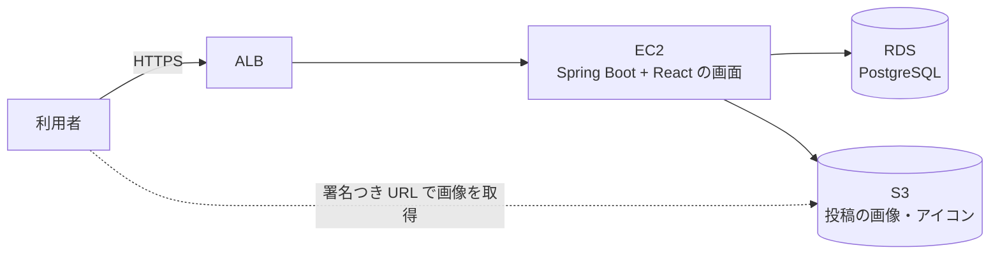
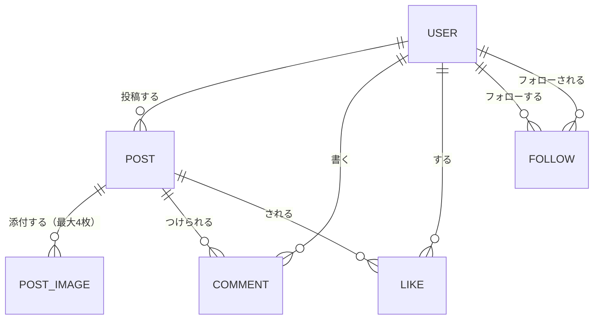

# 要件定義書：タイムライン型 SNS（RaiseTimeline）

| 項目 | 内容 |
|---|---|
| 文書番号 | 01 |
| 版数 | 0.8 |
| 作成日 | 2026-10-07 |
| 作成者 | major182 |
| 関連する文書 | [01-1 機能一覧](01-1_feature-list.md)、[02 技術選定書](02_tech-stack.md)、[03 DB 設計書](03_db-design.md)、[04 画面設計書](04_screen-design.md) |

---

## 目次

1. [はじめに](#1-はじめに)
2. [システム化の概要](#2-システム化の概要)
3. [業務ルール](#3-業務ルール)
4. [機能要件](#4-機能要件)
5. [データ要件](#5-データ要件)
6. [非機能要件](#6-非機能要件)
7. [制約条件・前提条件](#7-制約条件前提条件)
8. [受け入れ基準](#8-受け入れ基準)
9. [未決事項](#9-未決事項)
10. [用語集](#10-用語集)
11. [改訂履歴](#11-改訂履歴)

### この文書の読み方

- 要件にはすべて **ID** を振る。設計書・テスト仕様書・Issue からは、この ID で参照する

  | 接頭辞 | 種類 | 例 |
  |---|---|---|
  | `BR` | 業務ルール（Business Rule） | BR-01 |
  | `F` | 機能要件（Function） | F-PO-01 |
  | `NF` | 非機能要件（Non-Functional） | NF-SE-01 |
  | `C` | 制約条件（Constraint） | C-01 |
  | `Q` | 未決事項（Question） | Q-01 |

- 機能要件の一覧（画面・優先度つき）は [01-1 機能一覧](01-1_feature-list.md) にまとめる。本書は「何を満たすべきか」を、機能一覧は「どの機能で満たすか」を書く

---

## 1. はじめに

### 1.1 背景

X（旧 Twitter）のようなタイムライン型の SNS は、投稿・フォロー・いいね・コメントといった、Web アプリの典型的な要素がそろっている。
一方で、インプレッション数（表示回数）やリツイート（再投稿）の仕組みは、数字を追いかける使い方や、意図しない拡散を生みやすい。

### 1.2 目的

1. **学習**：認証・ファイル（画像）の保存・利用者どうしの関係（フォロー）・一覧の段階的な読み込みを、React + Spring Boot + AWS で一通り作れるようになる
2. **落ち着いて使える SNS**：インプレッション数を表示せず、リツイートを置かないことで、**フォローしている人の投稿を穏やかに読み書きできる**場にする
3. 反応（いいね・コメント）は**数として見える**ようにし、誰かに届いたことが分かるようにする

### 1.3 差別化のポイント

| 項目 | X（Twitter） | RaiseTimeline |
|---|---|---|
| インプレッション数（表示回数） | 表示する | **表示しない。記録もしない**（→ BR-40） |
| リツイート・引用 | ある | **置かない**（→ BR-41） |
| いいねの数・コメントの数 | 表示する | 表示する（→ BR-31、BR-32） |

### 1.4 スコープ

| 区分 | 内容 |
|---|---|
| 対象 | 利用者登録・ログイン、プロフィール、テキストの投稿、画像の投稿、タイムライン、コメント、いいね、フォロー・フォロワー、利用者の検索 |
| 対象外 | インプレッション数、リツイート・引用、ダイレクトメッセージ、通知、ハッシュタグ、トレンド、ブロック・ミュート、非公開アカウント（鍵アカウント）、動画の投稿、ネイティブアプリ（スマホアプリ）、外部サービスでのログイン（Google など） |

対象外のうち、通知・ブロックは、後から追加するかを Q-03 で決める。

### 1.5 利用者

| 利用者 | 想定人数 | 利用環境 | 主な利用場面 |
|---|---|---|---|
| 本人（開発者） | 1人 | PC の Chrome、スマホの Chrome | 実際に使うのは本人だけ。動作確認のため、テスト用の利用者を複数作って使う |
| 一般の利用者（想定） | 複数 | PC・スマホのブラウザ | **複数人で使う前提で設計する**。第三者がいいね・コメント・フォローすることを想定する |

---

## 2. システム化の概要

### 2.1 システム全体像

- 画面（React）はビルドして静的ファイルにし、Spring Boot から配信する（→ [02 技術選定書](02_tech-stack.md)）
- 画像は S3 に非公開で置き、表示するときだけ期限つきの URL（署名つき URL）を発行する

### 2.2 主な利用の流れ

1. 利用者登録をして、ログインする
2. 他の利用者を検索して、フォローする
3. タイムラインで、「フォロー中」タブ（フォローしている人の投稿と、その人たちがいいねした投稿）と「全体」タブ（全員の投稿）を切り替えて読む
4. 投稿に、いいね・コメントをする
5. テキストと画像で投稿する。自分の投稿は後から編集・削除できる

---

## 3. 業務ルール

### 3.1 利用者・認証

| ID | ルール |
|---|---|
| BR-01 | 利用者登録では、**ユーザー名・メールアドレス・パスワード・パスワード（確認）**を入れる。表示名は、最初はユーザー名と同じにする |
| BR-02 | ユーザー名（`@raise_user` のように表示する名前）は半角英数字とアンダースコア（`_`）で 4〜15 文字。**大文字・小文字を区別せずに重複を禁止する**。**登録後も変更できる** |
| BR-03 | 表示名は 1〜50 文字。重複してよい。後から変更できる |
| BR-04 | メールアドレスは重複を禁止する。ログインにはメールアドレスとパスワードを使う |
| BR-05 | パスワードは 8〜72 文字（72 は BCrypt の上限）。英字と数字をそれぞれ1文字以上含む。ハッシュ化して保存し、元の値は保存しない |
| BR-06 | ログインしていない人は、ログイン画面と利用者登録画面だけを見られる。投稿・プロフィールなどはすべてログインが必要 |
| BR-07 | ログインは、最後の操作から **7 日間**有効（その間は、再読み込みしてもログインしたまま）。ログアウトすると、その端末ではすぐにログインしていない状態になり、ログインを続けるための取り直しもできなくなる。ただし、ログアウトの前に発行した短い期限の鍵（アクセストークン）は、その期限（最大 15 分）までは有効（→ 技術選定書 4.1） |
| BR-08 | ログインに **5 回続けて失敗**したら、そのメールアドレスのログインを **15 分間**止める |
| BR-09 | 入力の誤りは、入力欄ごとに理由を表示する（例：パスワードとパスワード（確認）が一致しない、ユーザー名が使われている）。**ログインの失敗は「メールアドレスかパスワードが違います」とだけ表示し、どちらが違うかは教えない**（登録済みのメールアドレスを調べられないようにするため） |

### 3.2 投稿

| ID | ルール |
|---|---|
| BR-10 | 投稿の本文は **1〜280 文字**。文字数は Unicode のコードポイント（文字の番号）の数で数える。多くの絵文字は1文字、複数の文字を組み合わせた絵文字（家族の絵文字など）は複数文字になる（→ [03 DB 設計書](03_db-design.md) D-7） |
| BR-11 | 画像だけの投稿もできる。その場合、本文は 0 文字でよい。**本文も画像もない投稿はできない** |
| BR-12 | 投稿を**編集・削除できるのは、投稿した本人だけ**。他人の投稿には編集・削除の操作を出さない |
| BR-13 | 投稿を削除すると、その投稿のコメント・いいね・画像も消える |
| BR-14 | 投稿はすべての利用者に公開される（非公開アカウントはない） |
| BR-15 | 編集できるのは**本文（テキスト）だけ**。画像は変更できない（変えたいときは削除して投稿し直す）。編集後も BR-10、BR-11 を満たす必要がある。投稿日時・いいね・コメントはそのまま残す |
| BR-16 | 編集した投稿には「**編集済み**」と表示する。編集の履歴（前の本文）は残さない。編集できる期間に制限はない |

### 3.3 画像

| ID | ルール |
|---|---|
| BR-20 | 1つの投稿に添付できる画像は **最大 4 枚** |
| BR-21 | 形式は **JPEG・PNG・WebP・GIF**。ファイル名の拡張子ではなく、**ファイルの中身で形式を判定する** |
| BR-22 | 1枚あたり **5MB まで** |
| BR-23 | 画像の位置情報など（Exif）は、ブラウザで縮小・再エンコードして送るときに取り除く。サーバーでは形式と大きさだけを確かめる（Q-05） |
| BR-24 | アイコン画像（プロフィール）は1枚。形式・大きさの制限は BR-21、BR-22 と同じ |
| BR-25 | 自己紹介は 0〜160 文字 |

### 3.4 コメント・いいね

| ID | ルール |
|---|---|
| BR-30 | コメントは投稿に対してつける。本文は **1〜280 文字**。画像はつけられない。**コメントへのコメント（入れ子）は作らない** |
| BR-31 | 投稿には**コメントの数**を表示する |
| BR-32 | 投稿には**いいねの数**を表示する。いいねした人の一覧も見られる |
| BR-33 | 同じ利用者が同じ投稿にいいねできるのは **1 回だけ**。もう一度押すと取り消す |
| BR-34 | 自分の投稿にも、いいね・コメントができる |
| BR-35 | コメントを削除できるのは、**コメントした本人と、投稿した本人** |
| BR-36 | いいねの対象は投稿だけ。コメントにはいいねできない（→ Q-04） |

### 3.5 フォロー

| ID | ルール |
|---|---|
| BR-40 | **インプレッション数（投稿が表示された回数）は表示しない。記録もしない** |
| BR-41 | **リツイート・引用の機能は置かない** |
| BR-42 | フォローは承認なしで、すぐに成立する。フォローを外すのも、すぐに反映する |
| BR-43 | 自分自身はフォローできない。同じ人を2回フォローすることはできない |
| BR-44 | プロフィールには、**フォロー数とフォロワー数**、それぞれの一覧を表示する |

### 3.6 タイムライン

タイムラインは「**全体**」と「**フォロー中**」の2つのタブを持つ。フォロー中タブは、**2010年代後半の Twitter に近い使い心地**（いいね経由の投稿・留守中のハイライト）を目指す。ただし、インプレッション数（BR-40）とリツイート（BR-41）は扱わない。

| ID | ルール |
|---|---|
| BR-50 | タイムラインのタブは次の2つ。どちらも新しい順に並べる（反応の多さで並べ替えることはしない） |
| BR-50-1 | **全体タブ**：全員の投稿を、投稿日時の新しい順に並べる |
| BR-50-2 | **フォロー中タブ**：自分とフォローしている人の投稿を、投稿日時の新しい順に並べる。BR-50-3 の投稿を混ぜる |
| BR-50-3 | **いいね経由の投稿**（フォロー中タブだけ）：フォローしていない人の投稿のうち、**フォローしている人がいいねしたもの**を、そのいいねの時刻の位置に混ぜる。「○○さんがいいねしました」と添える。複数人がいいねしていれば「○○さん、ほか N 人がいいねしました」とする。同じ投稿は1回だけ出す |
| BR-51 | **最初はフォロー中タブ**を開く。選んだタブを端末ごとに覚えておく |
| BR-52 | **留守中のハイライト**（フォロー中タブだけ）：タイムラインを最後に開いてから **6 時間以上**たっていたら、その間のフォロー中の人（自分を除く）の投稿のうち、反応（いいね・コメント）の多いもの **最大 3 件**を、一覧の一番上に「留守中のハイライト」としてまとめて出す。反応が 0 件の投稿は出さない |
| BR-52-1 | ハイライトに出した投稿は、その下の一覧には出さない（重複させない） |
| BR-53 | 一度に読み込むのは **20 件**。下までスクロールすると、続きを読み込む。読んでいる間に新しい投稿やいいねが増えても、**同じ投稿が重複して出たり、抜けたりしない** |
| BR-54 | 新しい投稿は、画面を開き直すか、更新の操作をしたときに表示する（自動では流れてこない） |
| BR-55 | 「最後にタイムラインを開いた時刻」はハイライトのためだけに記録する。**どの投稿を見たか（表示回数）は記録しない**（BR-40） |

---

## 4. 機能要件

機能の一覧・画面・優先度は [01-1 機能一覧](01-1_feature-list.md) を参照する。ここでは機能の分類と、要件の要点を書く。

| 分類 | 接頭辞 | 要点 | 関連する業務ルール |
|---|---|---|---|
| 認証 | F-AU | 利用者登録・ログイン・ログアウト・パスワードの変更・入力の誤りの表示 | BR-01〜09 |
| 利用者・プロフィール | F-US | プロフィールの表示と編集、利用者の検索 | BR-02、BR-03、BR-24、BR-25 |
| 投稿 | F-PO | テキスト・画像の投稿、本人による編集・削除、詳細の表示 | BR-10〜16、BR-20〜23 |
| タイムライン | F-TL | 全体／フォロー中のタブ、いいね経由の投稿、留守中のハイライト、利用者ごとの投稿一覧 | BR-50〜55 |
| コメント | F-CM | コメントの投稿・一覧・削除、数の表示 | BR-30、BR-31、BR-35 |
| いいね | F-LK | いいね・取り消し、数の表示、いいねした人の一覧 | BR-32〜34、BR-36 |
| フォロー | F-FL | フォロー・解除、フォロー／フォロワーの一覧と数 | BR-42〜44 |

### 4.1 他の利用者の探し方（候補）

フォローする相手を見つける方法として、次の候補を比べた。**A + B + C を採用する**（2026-10-07 に決定。Q-01）。D は、2026-10-09 にタイムラインの全体タブとして採用した。

| 候補 | 方法 | 良い点 | 気になる点 | 推奨 |
|---|---|---|---|---|
| A | **ユーザー名・表示名で検索**（部分一致） | 相手が分かっていれば確実に見つかる。作りが単純で、学習に向く | 相手を知らないと探せない | ◎ 採用 |
| B | **投稿・コメント・いいね・フォロー一覧から、プロフィールへ移動**する | 追加の検索機能がいらない。知り合いの知り合いをたどれる | フォローが 0 人のうちは、たどる元がない | ◎ 採用 |
| C | **おすすめの利用者**を表示（フォローしている人がフォローしている人、まだフォローしていない人を優先） | フォローが少なくても見つかる。SQL の練習になる | 最初は「最近登録した人」で代わりに埋める必要がある | ○ 採用 |
| D | **みんなのタイムライン**（全員の投稿を新しい順） | 知らない人の投稿から見つけられる | 利用者が増えると流れが速くなる | ◎ 採用（タイムラインの全体タブ BR-50-1 として作る） |
| E | 投稿の本文で検索（全文検索） | 話題から人を探せる | 日本語の全文検索は難しい（PostgreSQL の標準では単語に分けられない） | × 対象外 |
| F | 招待リンク・QR コード | 知り合いを確実につなげる | 利用者が本人だけの今は効果が小さい | × 対象外 |

- A の検索は、ユーザー名と表示名の**部分一致**、大文字・小文字を区別しない。結果は 20 件ずつ表示する
- 利用者が少ないうちは、C は「最近登録した人」で代わりに埋める

---

## 5. データ要件

主なデータと、その関係を示す。項目の詳細は[03 DB 設計書](03_db-design.md)で決める。

| データ | 主な項目 | 備考 |
|---|---|---|
| 利用者 | ユーザー名、表示名、メールアドレス、パスワードのハッシュ、自己紹介、アイコン、登録日時、最後にタイムラインを開いた時刻 | 利用者は変わらない番号（内部の ID）で見分ける。ユーザー名を変えても、投稿・フォロー・いいねはそのまま残る（BR-02）。自己紹介は 160 文字まで。最後にタイムラインを開いた時刻は BR-52 のためだけに使う |
| 投稿 | 本文、投稿者、投稿日時、編集日時 | 編集日時があれば「編集済み」と表示する（BR-16）。削除したら物理的に消す |
| 投稿の画像 | 投稿、S3 上の保存先（キー）、並び順、形式、大きさ | S3 のファイルも一緒に消す |
| コメント | 本文、投稿、コメントした人、日時 | |
| いいね | 投稿、いいねした人、日時 | 投稿といいねした人の組で重複を禁止する（BR-33） |
| フォロー | フォローする人、フォローされる人、日時 | 組で重複を禁止し、同じ人どうしを禁止する（BR-43） |
| リフレッシュトークン | トークンのハッシュ、利用者、期限、無効にした日時 | ログインを続けるための鍵。元の値は保存しない。ログアウトで無効にする（BR-07） |

- **インプレッション（表示回数）のデータは持たない**（BR-40）
- いいねの数・コメントの数は、表示のたびに数える。遅くなったら、数を投稿に持たせる方式に切り替える（→ NF-PE-02）

---

## 6. 非機能要件

### 6.1 性能（PE）

| ID | 要件 |
|---|---|
| NF-PE-01 | タイムラインの 20 件の読み込み（全体・フォロー中のどちらでも）が、利用者 100 人・投稿 10 万件のデータで **1 秒以内**に返る |
| NF-PE-02 | いいねの数・コメントの数の表示で、投稿ごとに SQL を発行しない（N+1 にしない） |
| NF-PE-03 | 画像は、表示に使う URL を一覧の取得と一緒に返し、画像のための追加の API 呼び出しをしない |

### 6.2 セキュリティ（SE）

| ID | 要件 |
|---|---|
| NF-SE-01 | 通信はすべて HTTPS。HTTP で来たら HTTPS へ転送する（ALB で行う） |
| NF-SE-02 | ログインは JWT 方式。期限の短いアクセストークン（15 分）は画面のメモリだけに置き、`localStorage` などには保存しない。ログインを続けるためのリフレッシュトークンは `HttpOnly`・`Secure`・`SameSite=Strict` の Cookie に置き、JavaScript から読めないようにする |
| NF-SE-03 | 状態を変える操作は CSRF の対策をする。アクセストークンはヘッダーで送るので対象外。Cookie を使う操作（トークンの取り直し・ログアウト）は、`SameSite=Strict` と独自のヘッダーで守る |
| NF-SE-04 | 他人の投稿は編集・削除できず、他人のコメントは削除できない（BR-35 の場合を除く）。**画面で隠すだけでなく、API で権限を確かめる** |
| NF-SE-05 | XSS の対策をする。投稿・コメントの本文は画面に出すときにエスケープし、HTML として扱わない。Content-Security-Policy で、自分のサイト以外のスクリプトを動かさない（→ 技術選定書 4.7） |
| NF-SE-06 | S3 のバケットは非公開。画像は期限つきの署名つき URL で見せる |
| NF-SE-07 | DB のパスワードなどの秘密情報は、AWS のパラメータストアに置く。リポジトリ・画像・ログに出さない |
| NF-SE-08 | RDS と EC2 は外部から直接つながらない場所（プライベートサブネット）に置く。EC2 への管理の接続は SSM Session Manager で行い、SSH のポートを開けない |

### 6.3 可用性（AV）

| ID | 要件 |
|---|---|
| NF-AV-01 | 学習用のため、24 時間の稼働は求めない。使わない間は止めてよい（→ C-03） |
| NF-AV-02 | EC2 を2台以上に増やしても、ログインの状態が保たれる（アクセストークンはどの EC2 でも検証でき、リフレッシュトークンは DB に置く。ALB のスティッキーセッションに頼らない） |
| NF-AV-03 | RDS の自動バックアップを有効にする（保持 1 日） |

### 6.4 利用環境（EN）

| ID | 要件 |
|---|---|
| NF-EN-01 | 対応するブラウザは、PC とスマホの Chrome の最新版 |
| NF-EN-02 | 画面は、スマホ（幅 360px）から PC（幅 1280px）まで崩れずに使える |
| NF-EN-03 | 画面の文字は日本語 |

### 6.5 保守性（MA）

| ID | 要件 |
|---|---|
| NF-MA-01 | 型チェック・lint・整形チェック・テストを1つのコマンドで実行でき、GitHub Actions でプルリクエストごとに動く |
| NF-MA-02 | DB の構造の変更は、Flyway のマイグレーションでだけ行う |
| NF-MA-03 | AWS の構成は Terraform で作る。手作業で作った資源を残さない |

---

## 7. 制約条件・前提条件

| ID | 内容 |
|---|---|
| C-01 | 技術スタックは **React・Spring Boot・PostgreSQL・AWS**（利用者の指定） |
| C-02 | AWS は **EC2・RDS・S3・ALB** を使う（利用者の指定） |
| C-03 | 費用をできるだけ抑える。ALB は動かしている間ずっと料金がかかるため、使わない間は Terraform で消せるようにする（→ Q-02） |
| C-04 | 開発者は1人。学習しながら作る |
| C-05 | リポジトリは公開。秘密情報・AWS のアカウント ID などの識別子を、ファイル・履歴・Issue・Actions のログに出さない |
| C-06 | 技術のバージョンは、LTS があれば最新の LTS、なければ最新の安定版を使い、数字で書く |

---

## 8. 受け入れ基準

| No | 基準 |
|---|---|
| 1 | [01-1 機能一覧](01-1_feature-list.md) の機能がすべて、AWS 上（ALB 経由の HTTPS）で動く |
| 2 | 3人以上のテスト用の利用者で、フォロー・いいね・コメントをし合い、**数と一覧が正しく出る** |
| 3 | 画面のどこにも、インプレッション数とリツイートの操作が出ない |
| 4 | 他人の投稿を、API を直接呼んでも編集・削除できない。他人のコメントも削除できない（BR-35 の場合を除く） |
| 5 | 自動テストと静的チェックが、GitHub Actions で通る |
| 6 | タイムラインで、全体／フォロー中のタブ切替、いいね経由の投稿（「○○さんがいいねしました」）、留守中のハイライトが動き、スクロールしても重複も欠落もない |

---

## 9. 未決事項

| ID | 内容 | 推奨 | 期限 |
|---|---|---|---|
| Q-01 | ~~他の利用者の探し方~~ | **決定（2026-10-07）**：A + B + C | ― |
| Q-02 | HTTPS に使うドメイン名。ALB に正式な証明書（ACM）をつけるには、独自のドメインが要る | Route 53 で安いドメインを取る（年 $3〜15 程度）。取らない場合は、ALB の HTTP だけで学習を進め、NF-SE-01 を見直す | デプロイ設計書の作成まで |
| Q-03 | 対象外にした機能のうち、通知・ブロックを後から作るか | まずは作らない。全機能が動いた後に再検討する | 全機能の完成後 |
| Q-04 | ~~コメントにもいいねをつけるか~~ | **決定（2026-10-09）**：つけない（BR-36） | ― |
| Q-05 | ~~画像の Exif の除去と、表示用の縮小画像を、どこで作るか（サーバー・ブラウザ）~~ | **決定（2026-10-09）**：ブラウザで縮小・再エンコードしてから送る（Exif も同時に消える）。サーバーでは形式と大きさだけを確かめる。画面を通さずに API を直接呼ばれた場合は Exif が残りうることを受け入れる | ― |
| Q-06 | EC2 の台数（1台か2台か） | 普段は1台。NF-AV-02 の確認のときだけ2台にする | デプロイ設計書の作成まで |
| Q-07 | タイムラインの数値（ハイライトを出す間隔 6 時間・件数 3 件） | 仮の値で作り、使ってみて調整する（設定値にしておく） | 使い始めてから |

---

## 10. 用語集

| 用語 | 意味 |
|---|---|
| タイムライン | 投稿を並べた一覧。本アプリでは「タイムライン（ホーム）」の全体・フォロー中のタブと、「利用者ごと」の投稿一覧 |
| 全体／フォロー中 | タイムラインのタブ。全体は全員の投稿、フォロー中は自分とフォローしている人の投稿（いいね経由の投稿を含む） |
| いいね経由の投稿 | フォローしていない人の投稿のうち、フォローしている人がいいねしたもの |
| 留守中のハイライト | しばらくタイムラインを開いていなかったとき、その間の反応の多い投稿を一番上にまとめたもの |
| フォロー | 他の利用者の投稿を、自分のフォロー中タブに表示するよう登録すること |
| フォロワー | 自分をフォローしている利用者 |
| インプレッション数 | 投稿が他の人の画面に表示された回数。本アプリでは扱わない |
| リツイート | 他人の投稿を、自分のフォロワーのタイムラインに再投稿すること。本アプリでは扱わない |
| ユーザー名 | 利用者ごとに重複しない名前（`@raise_user` のように表示する）。後から変更できる |
| 表示名 | 投稿などで名前として表示する、自由な名前。重複してよい |
| 署名つき URL | S3 の非公開のファイルを、期限つきで見られるようにする URL |
| カーソル方式 | 「最後に読んだものより後」を条件に続きを取る、一覧の読み込み方 |
| ALB | Application Load Balancer。利用者からの通信を受け、EC2 に振り分ける AWS のサービス |

---

## 11. 改訂履歴

| 版数 | 日付 | 内容 |
|---|---|---|
| 0.1 | 2026-10-07 | 初版 |
| 0.2 | 2026-10-07 | Q-01 を A + B + C に決定。投稿の編集を対象に追加（BR-12、BR-15、BR-16）。ホームのタイムラインを、フォロー中を優先した全員の投稿の一覧に変更（BR-50〜52）。Q-07 を追加 |
| 0.3 | 2026-10-07 | ホームのタイムラインを、2010年代後半の Twitter に近い形に変更（トップ／最新の切り替え、いいね経由の投稿、留守中のハイライト。BR-50〜55）。全員の投稿をホームに出すのをやめ、候補 D を対象外に。Q-07 を更新 |
| 0.4 | 2026-10-09 | 画面ごとの機能要件を反映。タイムラインを全体／フォロー中のタブに変更し、トップ／最新の切り替えをやめた（BR-50〜52。候補 D を採用）。投稿・コメントを 280 文字に（BR-10、BR-30）。ユーザー ID をユーザー名と呼び、登録後も変更可能に（BR-01、BR-02）。投稿の編集をテキストだけに（BR-15）。入力の誤りの表示（BR-09）と自己紹介の文字数（BR-25）を追加 |
| 0.5 | 2026-10-09 | 文字数の数え方を、DB 設計書 D-7 に合わせてコードポイントの数に明確化（BR-10）。DB 設計書への参照を追加 |
| 0.6 | 2026-10-09 | 認証をセッション方式から JWT 方式に変更（BR-07・NF-SE-02・NF-SE-03・NF-AV-02、データ要件）。XSS の対策を強化（NF-SE-05） |
| 0.7 | 2026-10-09 | Q-04 を「コメントにはいいねをつけない」に決定 |
| 0.8 | 2026-10-09 | Q-05 を決定し、BR-23 を「Exif はブラウザで取り除く」に変更 |
