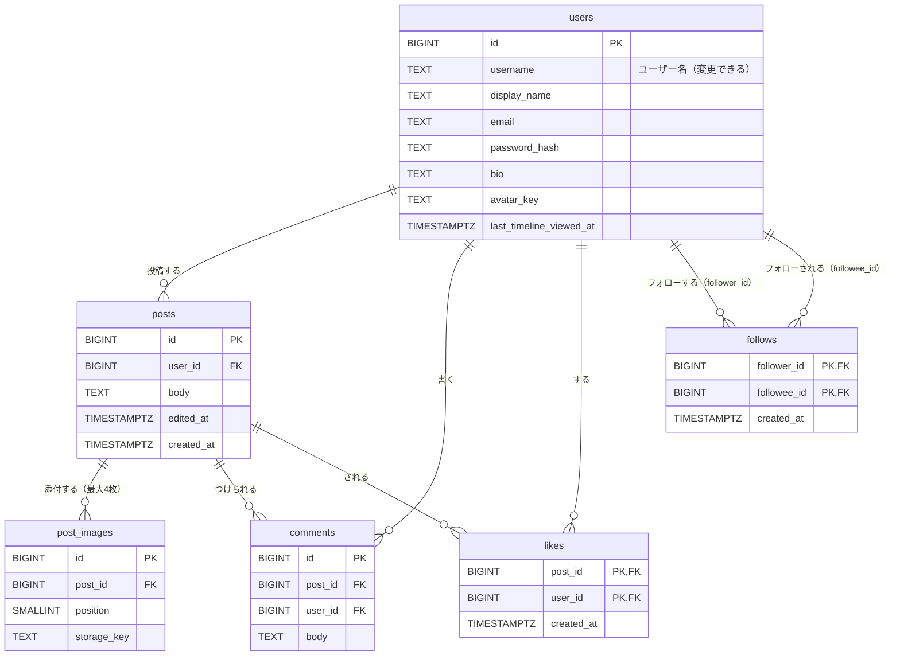

# DB 設計書：タイムライン型 SNS（RaiseTimeline）

| 項目 | 内容 |
|---|---|
| 文書番号 | 03 |
| 版数 | 0.3 |
| 作成日 | 2026-10-09 |
| 作成者 | major182 |
| 前提となる文書 | [01 要件定義書](01_requirements.md)、[01-1 機能一覧](01-1_feature-list.md)、[02 技術選定書](02_tech-stack.md) |

---

## 目次

1. [設計方針](#1-設計方針)
2. [ER 図](#2-er-図)
3. [テーブル一覧](#3-テーブル一覧)
4. [テーブル定義](#4-テーブル定義)
5. [データの取り出し方](#5-データの取り出し方)
6. [業務ルールとの対応](#6-業務ルールとの対応)
7. [初期データ](#7-初期データ)
8. [改訂履歴](#8-改訂履歴)

---

## 1. 設計方針

### 1.1 前提

- DB は **PostgreSQL 18.6**（開発・テストは Docker、本番は RDS）
- テーブルの作成・変更は **Flyway のマイグレーション**（`backend/src/main/resources/db/migration/`）だけで行う（NF-MA-02）。JPA の `ddl-auto` は `validate` のままにし、テーブルとエンティティのずれを起動時に見つける
- テーブル名・列名は英語の小文字とアンダースコア（`snake_case`）。テーブル名は複数形

### 1.2 設計上の決定事項

| No | 決定事項 | 理由 |
|---|---|---|
| D-1 | 利用者は**変わらない番号（`users.id`）**で見分ける。投稿・いいね・フォローは、ユーザー名ではなくこの番号で利用者を指す | ユーザー名は後から変えられる（BR-02）。名前で結び付けると、変えたときに全テーブルを直す必要が出る |
| D-2 | **いいねの数・コメントの数は列に持たない**。表示のたびに数える | 数を列に持つと、いいねのたびに投稿の行を更新する必要があり、同時に押されたときにずれやすい。遅くなったら列に持つ方式に切り替える（要件定義書 5章、NF-PE-02） |
| D-3 | **インプレッション（表示回数）のテーブル・列を作らない** | BR-40。「最後にタイムラインを開いた時刻」だけはハイライトのために持つ（BR-55） |
| D-4 | 投稿を消すときは**物理的に削除**し、画像・コメント・いいねも外部キーの `ON DELETE CASCADE` で一緒に消す | BR-13。論理削除（削除の印を付けて残す）は、一覧のたびに印を条件に入れる必要があり、学習の初期には負担が大きい |
| D-5 | 画像のファイルは S3 に置き、DB には**保存先のキー（S3 上の名前）**だけを持つ | 画像を DB に入れると DB が大きくなり、バックアップも重くなる |
| D-6 | 日時は **`TIMESTAMPTZ`（時差つきの日時）**で持ち、UTC で保存する。画面で日本時間に直して表示する | EC2・RDS の時刻の設定に左右されないようにする |
| D-7 | 文字数は **Unicode のコードポイント（文字の番号）の数**で数える。Java の `String.codePointCount` と PostgreSQL の `char_length` が同じ数を返すので、画面・アプリ・DB の3か所で同じ基準になる | 多くの絵文字は1文字になる（BR-10）。家族の絵文字のように複数の文字を組み合わせた絵文字は、複数文字に数える |
| D-8 | ユーザー名・メールアドレスの重複は、**小文字にした値の UNIQUE 索引**で禁止する | 大文字・小文字を区別せずに重複を禁止する（BR-02、BR-04）。表示は登録したときの大文字・小文字のまま |
| D-9 | リフレッシュトークンは、**元の値ではなく SHA-256 のハッシュ**だけを保存する。アクセストークン（JWT）は DB に保存しない | DB が漏れても、ログインを続けるための鍵として使えないようにする。アクセストークンは署名と期限で検証できるので、保存する必要がない |

### 1.3 そのほかの方針

- **主キー**は `BIGINT GENERATED ALWAYS AS IDENTITY`（自動の連番）。いいね・フォローは、2つの列の組を主キーにする（同じ組を2回登録できないことを、主キーで守る）
- **外部キーの削除時の動き**は、すべて `ON DELETE CASCADE`（親を消したら子も消す）。利用者の退会は対象外だが、テスト用のデータを消すときに一緒に消えるようにしておく
- **文字列**は、長さの上限を CHECK 制約で守り、型は `TEXT` にする（PostgreSQL では `VARCHAR(n)` と `TEXT` の性能は同じで、上限の変更が CHECK 制約の差し替えだけで済む）
- 制約は**画面・アプリ・DB の3か所**で守る。画面のチェックは使いやすさのため、アプリ（Bean Validation とサービス層）のチェックは誤りの理由を返すため、DB の制約は最後の安全網

---

## 2. ER 図



---

## 3. テーブル一覧

| No | テーブル | 名前 | 内容 | 関連する機能 |
|---|---|---|---|---|
| 1 | `users` | 利用者 | 登録した利用者。プロフィールとログインの情報 | F-AU、F-US |
| 2 | `posts` | 投稿 | 投稿の本文 | F-PO、F-TL |
| 3 | `post_images` | 投稿の画像 | 投稿に添付した画像（S3 の保存先） | F-PO-02、F-PO-05 |
| 4 | `comments` | コメント | 投稿へのコメント | F-CM |
| 5 | `likes` | いいね | 誰がどの投稿にいいねしたか | F-LK、F-TL-07、F-TL-08 |
| 6 | `follows` | フォロー | 誰が誰をフォローしているか | F-FL、F-TL-01、F-US-04 |
| 7 | `refresh_tokens` | リフレッシュトークン | ログインを続けるための鍵（ハッシュ） | F-AU-01〜03、F-AU-05 |

---

## 4. テーブル定義

### 4.0 表の見方

| 列の見出し | 意味 |
|---|---|
| 必須 | ○：値が必ず入る（NOT NULL）／空：値がない場合がある（NULL を許す） |
| 既定値 | 値を指定しなかったときに入る値 |
| 制約・説明 | 値の範囲、ほかのテーブルとの関係（→ 参照先）、意味 |
| 出典 | 根拠になる業務ルール・機能 |

- **共通の列**：`users`・`posts`・`comments` には次の列がある。各表では省略する（`post_images`・`likes`・`follows` は `created_at` だけを持つ）

  | 列名 | 型 | 必須 | 既定値 | 説明 |
  |---|---|---|---|---|
  | `created_at` | TIMESTAMPTZ | ○ | `now()` | 作成日時 |
  | `updated_at` | TIMESTAMPTZ | ○ | `now()` | 更新日時（アプリが更新のたびに入れる） |

- **文字数**は D-7 のとおりコードポイントで数える。表の「1〜280 文字」は `char_length(列) BETWEEN 1 AND 280` の CHECK 制約を表す

### 4.1 `users`（利用者）

| 列名 | 型 | 必須 | 既定値 | 制約・説明 | 出典 |
|---|---|---|---|---|---|
| `id` | BIGINT | ○ | 自動の連番 | 主キー。利用者を見分ける変わらない番号（D-1） | ― |
| `username` | TEXT | ○ | | ユーザー名。正規表現 `^[A-Za-z0-9_]{4,15}$` に合うこと。`lower(username)` で重複を禁止（D-8） | BR-02 |
| `display_name` | TEXT | ○ | | 表示名。1〜50 文字。登録時は `username` と同じ値を入れる | BR-01、BR-03 |
| `email` | TEXT | ○ | | メールアドレス。254 文字まで。`lower(email)` で重複を禁止（D-8） | BR-04 |
| `password_hash` | TEXT | ○ | | パスワードのハッシュ（BCrypt）。元のパスワードは保存しない | BR-05 |
| `bio` | TEXT | ○ | `''` | 自己紹介。0〜160 文字 | BR-25 |
| `avatar_key` | TEXT | | | アイコン画像の S3 のキー。未設定なら NULL（画面では既定のアイコンを出す） | BR-24 |
| `last_timeline_viewed_at` | TIMESTAMPTZ | | | 最後にフォロー中タブを開いた時刻。留守中のハイライトのためだけに使う | BR-52、BR-55 |
| `failed_login_count` | INTEGER | ○ | `0` | 続けてログインに失敗した回数。0 以上。成功したら 0 に戻す | BR-08 |
| `locked_until` | TIMESTAMPTZ | | | この時刻まではログインさせない。5 回続けて失敗したら「今 + 15 分」を入れる | BR-08 |

**索引**

| 索引 | 列 | 種類 | 目的 |
|---|---|---|---|
| `users_username_lower_key` | `lower(username)` | UNIQUE | ユーザー名の重複禁止、プロフィールの URL（`/users/{ユーザー名}`）からの検索 |
| `users_email_lower_key` | `lower(email)` | UNIQUE | メールアドレスの重複禁止、ログイン |
| `users_username_trgm_idx` | `lower(username)` | GIN（`pg_trgm`） | 利用者の検索（部分一致）を速くする（5.6） |
| `users_display_name_trgm_idx` | `lower(display_name)` | GIN（`pg_trgm`） | 同上 |

### 4.2 `posts`（投稿）

| 列名 | 型 | 必須 | 既定値 | 制約・説明 | 出典 |
|---|---|---|---|---|---|
| `id` | BIGINT | ○ | 自動の連番 | 主キー | ― |
| `user_id` | BIGINT | ○ | | 投稿した人 → `users.id` | BR-12 |
| `body` | TEXT | ○ | `''` | 本文。0〜280 文字。0 文字は画像だけの投稿のとき（BR-11。画像があるかは別テーブルのため、アプリで確かめる） | BR-10、BR-11 |
| `edited_at` | TIMESTAMPTZ | | | 最後に編集した時刻。NULL なら未編集。値があれば「編集済み」と表示する | BR-15、BR-16 |

- `updated_at` は行を更新したときの時刻（仕組みのための値）。「編集済み」の判定には使わず、`edited_at` を使う

**索引**

| 索引 | 列 | 目的 |
|---|---|---|
| `posts_created_idx` | `(created_at DESC, id DESC)` | 全体タブ（5.1） |
| `posts_user_created_idx` | `(user_id, created_at DESC, id DESC)` | フォロー中タブ・利用者ごとの投稿一覧（5.2、5.4） |

### 4.3 `post_images`（投稿の画像）

| 列名 | 型 | 必須 | 既定値 | 制約・説明 | 出典 |
|---|---|---|---|---|---|
| `id` | BIGINT | ○ | 自動の連番 | 主キー | ― |
| `post_id` | BIGINT | ○ | | 投稿 → `posts.id` | ― |
| `position` | SMALLINT | ○ | | 並び順。1〜4。`(post_id, position)` で重複を禁止 | BR-20 |
| `storage_key` | TEXT | ○ | | S3 のキー（例：`posts/2026/10/<ランダムな文字列>.webp`）。重複を禁止 | D-5 |
| `content_type` | TEXT | ○ | | 形式。`image/jpeg`・`image/png`・`image/webp`・`image/gif` のどれか（中身で判定した結果） | BR-21 |
| `size_bytes` | INTEGER | ○ | | 大きさ（バイト）。1〜5,242,880（5MB） | BR-22 |
| `width` | INTEGER | ○ | | 幅（ピクセル）。1 以上。画面で枠の形を先に決め、読み込み中のずれを防ぐ | ― |
| `height` | INTEGER | ○ | | 高さ（ピクセル）。1 以上 | ― |

- 投稿を消すと行も消える（D-4）。**S3 のファイルは、アプリが DB の削除の確定後に消す**（DB と S3 は1つのトランザクションにできないため。消し損ねたファイルは、後で S3 のキーの一覧と DB を突き合わせて掃除する）
- アイコン画像は `users.avatar_key` に持ち、このテーブルは使わない

### 4.4 `comments`（コメント）

| 列名 | 型 | 必須 | 既定値 | 制約・説明 | 出典 |
|---|---|---|---|---|---|
| `id` | BIGINT | ○ | 自動の連番 | 主キー | ― |
| `post_id` | BIGINT | ○ | | コメントした投稿 → `posts.id` | BR-30 |
| `user_id` | BIGINT | ○ | | コメントした人 → `users.id` | BR-35 |
| `body` | TEXT | ○ | | 本文。1〜280 文字 | BR-30 |

**索引**

| 索引 | 列 | 目的 |
|---|---|---|
| `comments_post_created_idx` | `(post_id, created_at, id)` | 投稿の詳細でのコメントの一覧（古い順）と、コメントの数 |

### 4.5 `likes`（いいね）

| 列名 | 型 | 必須 | 既定値 | 制約・説明 | 出典 |
|---|---|---|---|---|---|
| `post_id` | BIGINT | ○ | | いいねした投稿 → `posts.id`。主キーの一部 | BR-33 |
| `user_id` | BIGINT | ○ | | いいねした人 → `users.id`。主キーの一部 | BR-33 |
| `created_at` | TIMESTAMPTZ | ○ | `now()` | いいねした時刻。フォロー中タブの「いいね経由の投稿」の並びに使う | BR-50-3 |

- 主キー `(post_id, user_id)` で、同じ人が同じ投稿に2回いいねできないことを守る（BR-33）
- 取り消しは行の削除

**索引**

| 索引 | 列 | 目的 |
|---|---|---|
| 主キー | `(post_id, user_id)` | いいねの数、自分がいいね済みか、いいねした人の一覧 |
| `likes_user_created_idx` | `(user_id, created_at DESC)` | フォロー中の人がいいねした投稿を探す（5.2） |

### 4.6 `follows`（フォロー）

| 列名 | 型 | 必須 | 既定値 | 制約・説明 | 出典 |
|---|---|---|---|---|---|
| `follower_id` | BIGINT | ○ | | フォローする人 → `users.id`。主キーの一部 | BR-42 |
| `followee_id` | BIGINT | ○ | | フォローされる人 → `users.id`。主キーの一部。`follower_id` と同じ値は禁止（CHECK） | BR-43 |
| `created_at` | TIMESTAMPTZ | ○ | `now()` | フォローした時刻。一覧の並び（新しい順）に使う | BR-44 |

**索引**

| 索引 | 列 | 目的 |
|---|---|---|
| 主キー | `(follower_id, followee_id)` | フォローの一覧、フォロー数、フォロー済みか |
| `follows_followee_created_idx` | `(followee_id, created_at DESC)` | フォロワーの一覧、フォロワー数 |

### 4.7 `refresh_tokens`（リフレッシュトークン）

技術選定書 4.1 の JWT 方式で、ログインを続けるための鍵。1行が1つの端末のログインにあたる。

| 列名 | 型 | 必須 | 既定値 | 制約・説明 | 出典 |
|---|---|---|---|---|---|
| `id` | BIGINT | ○ | 自動の連番 | 主キー | ― |
| `user_id` | BIGINT | ○ | | 利用者 → `users.id` | ― |
| `token_hash` | TEXT | ○ | | トークンの SHA-256 のハッシュ（16 進数 64 文字）。重複を禁止 | D-9 |
| `expires_at` | TIMESTAMPTZ | ○ | | 期限。発行の 7 日後 | BR-07 |
| `revoked_at` | TIMESTAMPTZ | | | 無効にした日時。NULL なら有効。取り直し・ログアウト・パスワードの変更で入れる | BR-07 |
| `revoke_reason` | TEXT | | | 無効にした理由。`ROTATED`（取り直しで使い終わった）／`LOGOUT`／`PASSWORD_CHANGED`／`REUSE_DETECTED`（使い回しを検知）。`revoked_at` と同時に入れる（CHECK） | ― |
| `created_at` | TIMESTAMPTZ | ○ | `now()` | 発行した日時 | ― |

**索引**

| 索引 | 列 | 目的 |
|---|---|---|
| `refresh_tokens_token_hash_key` | `token_hash` | UNIQUE。取り直しのときにトークンを探す |
| `refresh_tokens_user_idx` | `user_id` | 利用者のトークンをまとめて無効にする（使い回しの検知・パスワードの変更） |

- **使い回しの検知**：取り直しで使い終わったトークン（`revoke_reason = ROTATED`）で再び取り直しを求められたら、盗まれたとみなし、その利用者の有効なトークンをすべて無効にする（技術選定書 4.1）。ログアウト・パスワードの変更で無効にしたトークンが届くのは普通に起こるので、断るだけにする
- 期限切れ・無効にしたトークンの行は、1 日に 1 回まとめて消す（無効にしてから 7 日たったもの）

---

## 5. データの取り出し方

一覧はすべて**カーソル方式**で 20 件ずつ取る（BR-53、技術選定書 4.4）。下の SQL は考え方を示すもので、実際のコードでは値をパラメータで渡す（`:me` はログインしている利用者の ID）。

### 5.1 全体タブ（F-TL-05）

```sql
SELECT p.*
FROM posts p
WHERE (p.created_at, p.id) < (:cursor_created_at, :cursor_id)   -- 2回目以降だけ
ORDER BY p.created_at DESC, p.id DESC
LIMIT 20;
```

- `(created_at, id)` の組で比べるので、同じ時刻の投稿があっても順番が決まり、重複・欠落しない

### 5.2 フォロー中タブ（F-TL-01、F-TL-07）

自分とフォロー中の人の投稿（A）と、いいね経由の投稿（B）をまとめ、「並びの時刻」の新しい順に並べる。

```sql
WITH following AS (
  SELECT followee_id AS user_id FROM follows WHERE follower_id = :me
  UNION ALL SELECT :me
),
feed AS (
  -- A：自分とフォロー中の人の投稿。並びの時刻は投稿日時
  SELECT p.id AS post_id, p.created_at AS sort_at, NULL::BIGINT AS liked_by
  FROM posts p
  WHERE p.user_id IN (SELECT user_id FROM following)
  UNION ALL
  -- B：フォロー中の人がいいねした、フォローしていない人の投稿。
  --    並びの時刻は「基準の時刻より前で最も新しい、フォロー中の人のいいね」
  --    UNION の片側で ORDER BY を使うため、副問い合わせに包む
  SELECT liked.* FROM (
    SELECT DISTINCT ON (l.post_id) l.post_id, l.created_at, l.user_id
    FROM likes l
    JOIN posts p ON p.id = l.post_id
    WHERE l.user_id IN (SELECT followee_id FROM follows WHERE follower_id = :me)
      AND l.created_at < :base_time
      AND p.user_id NOT IN (SELECT user_id FROM following)
    ORDER BY l.post_id, l.created_at DESC
  ) liked
)
SELECT * FROM feed
WHERE (sort_at, post_id) < (:cursor_sort_at, :cursor_post_id)        -- 2回目以降だけ
  AND post_id NOT IN (:highlight_post_ids)                          -- ハイライトに出したもの
ORDER BY sort_at DESC, post_id DESC
LIMIT 20;
```

- `:base_time` は最初に読み込んだ時刻。読み進める間についた新しいいいねで、投稿が上に移動しないようにする
- A と B は投稿者の条件で分かれるので、同じ投稿が両方に入ることはない
- 「○○さん、ほか N 人がいいねしました」の表示は、取り出した 20 件の投稿について、フォロー中の人のいいねを別に数えて付ける（5.5）

### 5.3 留守中のハイライト（F-TL-08）

フォロー中タブの最初の読み込みのときだけ行う。

1. `users.last_timeline_viewed_at` を読む。NULL か、今から 6 時間以内なら、ハイライトは出さない
2. 6 時間以上前なら（6 時間・3 件は設定値 `app.timeline`。要件定義書 Q-07）、その時刻から今までに投稿された、フォロー中の人（自分を除く）の投稿のうち、`いいねの数 + コメントの数 × 2` が 1 以上のものを多い順に最大 3 件取る（同じ点なら新しい順）
3. `last_timeline_viewed_at` を今の時刻に更新する
4. 取った投稿の ID をカーソルに含め、5.2 の一覧から除く

### 5.4 利用者ごとの投稿一覧（F-TL-03）

5.1 に `WHERE p.user_id = :user_id` を加えたもの。索引 `posts_user_created_idx` を使う。

### 5.5 投稿カードに付ける情報（NF-PE-02）

一覧の 20 件を取った後、**投稿の ID の配列でまとめて**次を取る（投稿ごとに SQL を発行しない）。

| 情報 | 取り方 |
|---|---|
| 投稿者 | `users` を `id = ANY(:user_ids)` で取る |
| 画像 | `post_images` を `post_id = ANY(:post_ids)` で、`position` の順に取る |
| いいねの数 | `SELECT post_id, count(*) FROM likes WHERE post_id = ANY(:post_ids) GROUP BY post_id` |
| コメントの数 | `comments` を同じ形で数える |
| 自分がいいね済みか | `likes` を `user_id = :me AND post_id = ANY(:post_ids)` で取る |
| いいね経由の表示 | フォロー中の人のいいねを `post_id = ANY(:post_ids)` で取り、最も新しい人の表示名と、残りの人数を数える |

画像の署名つき URL は、`storage_key` からアプリで発行する（DB には持たない。NF-SE-06）。

### 5.6 利用者の検索（F-US-03）

```sql
SELECT * FROM users
WHERE lower(username) LIKE '%' || lower(:q) || '%'
   OR lower(display_name) LIKE '%' || lower(:q) || '%'
ORDER BY (lower(username) = lower(:q)) DESC,   -- ユーザー名が完全に一致する人を先頭に
         id DESC
LIMIT 20 OFFSET :offset;
```

- 部分一致（`LIKE '%…%'`）は普通の索引が効かないので、PostgreSQL の拡張機能 **`pg_trgm`**（文字列を3文字ずつに分けて索引にする仕組み）の GIN 索引を使う。RDS でも使える
- 検索語の `%` と `_` は、LIKE の特別な記号にならないようエスケープする
- 検索は件数が少なく、並びが途中で変わっても困らないので、OFFSET で続きを取る
- 検索語は 1〜50 文字。空なら検索しない

### 5.7 おすすめの利用者（F-US-04）

1. 「フォロー中の人がフォローしている人」のうち、自分と、自分がすでにフォローしている人を除き、**フォロー中の何人からフォローされているか**の多い順に最大 5 人
2. 5 人に満たなければ、残りを「最近登録した人」（同じく自分とフォロー済みの人を除く）で埋める

### 5.8 ログインの失敗の数え方（BR-08）

| 場面 | 動き |
|---|---|
| `locked_until` が今より後 | パスワードを確かめずに失敗にする（回数は増やさない） |
| パスワードが違う | `failed_login_count` を 1 増やす。5 になったら `locked_until = 今 + 15 分`、`failed_login_count = 0` |
| パスワードが合う | `failed_login_count = 0`、`locked_until = NULL` にしてログインさせる |
| メールアドレスが登録されていない | 何も記録しない。画面には同じ失敗のメッセージを出す（BR-09） |

---

## 6. 業務ルールとの対応

| 業務ルール | どこで守るか |
|---|---|
| BR-02 ユーザー名の形式・重複 | DB：CHECK（正規表現）、`lower(username)` の UNIQUE。アプリ：同じチェックで、使われていれば理由を返す |
| BR-04 メールアドレスの重複 | DB：`lower(email)` の UNIQUE |
| BR-05 パスワード | アプリ：長さ・文字の種類のチェック、BCrypt のハッシュ化。DB にはハッシュだけを持つ |
| BR-07 ログインの期限・ログアウト | `refresh_tokens.expires_at`・`revoked_at`（4.7） |
| BR-08 ログインの一時停止 | `users.failed_login_count`・`locked_until`（5.8） |
| BR-10・BR-30 280 文字 | DB：CHECK（`char_length`）。アプリ・画面：同じ数え方（D-7） |
| BR-11 本文も画像もない投稿の禁止 | アプリ（サービス層）。2つのテーブルにまたがるため DB の制約にできない |
| BR-12・BR-35 本人だけ編集・削除 | アプリ（サービス層で `user_id` を確かめる。NF-SE-04） |
| BR-13 削除で一緒に消す | DB：`ON DELETE CASCADE`。S3 のファイルはアプリ（4.3） |
| BR-16 編集済み | `posts.edited_at` |
| BR-20 画像は最大 4 枚 | DB：`position` 1〜4 と `(post_id, position)` の UNIQUE |
| BR-21・BR-22 画像の形式・大きさ | アプリ：中身で判定。DB：`content_type` と `size_bytes` の CHECK |
| BR-33 いいねは1回だけ | DB：主キー `(post_id, user_id)` |
| BR-40・BR-55 表示回数を持たない | テーブル・列を作らない（D-3） |
| BR-43 自分はフォローできない・2回できない | DB：CHECK（`follower_id <> followee_id`）、主キー |
| BR-50〜53 タイムライン | 5.1〜5.4 |

---

## 7. 初期データ

本番の初期データはない（利用者は画面から登録する）。

- **拡張機能**：最初のマイグレーションで `CREATE EXTENSION IF NOT EXISTS pg_trgm;` を実行する
- **開発用のテストデータ**：動作確認のため、テスト用の利用者 3 人（フォロー・いいね・コメントをし合った状態）と投稿を、開発環境だけで入れる。本番に入らないよう、Flyway の通常のマイグレーションとは別の場所（`db/dev-data/`）に置き、開発のプロファイルのときだけ読み込む

---

## 8. 改訂履歴

| 版数 | 日付 | 内容 |
|---|---|---|
| 0.1 | 2026-10-09 | 初版 |
| 0.2 | 2026-10-09 | 認証の JWT 方式への変更に合わせ、Spring Session のテーブルをやめて refresh_tokens を追加（D-9、4.7） |
| 0.3 | 2026-10-09 | タイムラインの実装に合わせ、5.2 の SQL のいいね経由の部分を副問い合わせに包んだ（UNION の片側では ORDER BY が使えない）。5.3 の数値を設定値と明記 |
