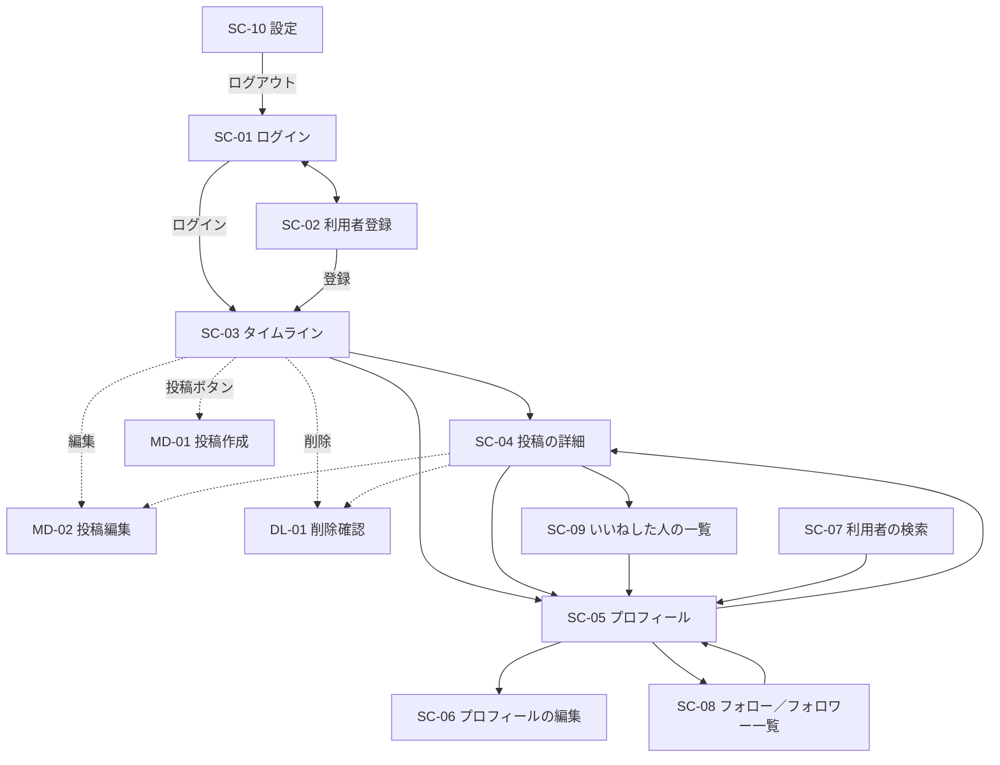

# 画面設計書：タイムライン型 SNS（RaiseTimeline）

| 項目 | 内容 |
|---|---|
| 文書番号 | 04 |
| 版数 | 0.3 |
| 作成日 | 2026-10-09 |
| 作成者 | major182 |
| 前提となる文書 | [01 要件定義書](01_requirements.md)、[01-1 機能一覧](01-1_feature-list.md)、[02 技術選定書](02_tech-stack.md)、[03 DB 設計書](03_db-design.md) |

---

## 目次

1. [共通方針](#1-共通方針)
2. [画面遷移図](#2-画面遷移図)
3. [画面一覧と URL](#3-画面一覧と-url)
4. [共通の部品](#4-共通の部品)
5. [画面ごとの詳細](#5-画面ごとの詳細)
6. [メッセージ一覧](#6-メッセージ一覧)
7. [機能との対応](#7-機能との対応)
8. [改訂履歴](#8-改訂履歴)

### この文書の位置づけ

- 画面の**項目・動き・URL・メッセージの文言**の正。実装はこれに合わせる
- 見た目の細部（余白・色の具体的な値）は、Material UI の標準に任せ、ここでは決めない
- 画面の ID は `SC`（画面）・`MD`（モーダル）・`DL`（ダイアログ）で始める

---

## 1. 共通方針

### 1.1 画面の骨組み

画面の幅によって、骨組みを切り替える。境目は Material UI の標準のブレークポイント（`md` = 900px）。

**PC（幅 900px 以上）**：3 列

```
┌──────────┬──────────────────────┬──────────────┐
│ ナビ      │ メインの列（幅 600px）  │ 横の欄         │
│ ・ホーム   │                      │ ・おすすめの   │
│ ・検索     │   画面ごとの内容       │   利用者      │
│ ・プロフィール│                    │  （SC-03 だけ）│
│ ・設定     │                      │              │
│ [投稿する] │                      │              │
│ 自分のアイコン│                    │              │
└──────────┴──────────────────────┴──────────────┘
```

**スマホ（幅 900px 未満）**：1 列

```
┌──────────────────────┐
│ 上の帯（画面の名前・戻る）│
├──────────────────────┤
│                      │
│   画面ごとの内容       │
│                 (＋) │ ← 投稿ボタン（右下に浮かぶ丸いボタン）
├──────────────────────┤
│ ホーム 検索 プロフィール 設定 │ ← 下のナビ
└──────────────────────┘
```

- ログイン（SC-01）と利用者登録（SC-02）は、ナビを出さず、中央に入力欄だけを置く
- 横の欄の「おすすめの利用者」は、PC のタイムライン（SC-03）だけに出す。スマホでは検索（SC-07）に出す

### 1.2 Material UI の部品の使い分け

| 用途 | 部品 |
|---|---|
| ナビ（PC） | `Drawer`（固定表示）+ `List` |
| ナビ（スマホ） | `BottomNavigation` |
| 投稿ボタン（スマホ） | `Fab` |
| タブ | `Tabs` / `Tab` |
| 投稿カード | `Card` 相当の枠（`Box` + 区切り線）。カードの影は付けず、線で区切る |
| 入力欄 | `TextField`（誤りは `error` と `helperText` で入力欄の下に出す） |
| モーダル | `Dialog`（スマホでは全画面 `fullScreen`） |
| 完了・失敗の知らせ | `Snackbar` + `Alert`（画面の下に数秒出す） |
| 読み込み中 | `CircularProgress`、一覧の最初の読み込みは `Skeleton` |
| アイコン | `@mui/icons-material`（いいね：`FavoriteBorder` / `Favorite`、コメント：`ChatBubbleOutline` など） |

### 1.3 日時・数の表示

| 対象 | 表示 |
|---|---|
| 投稿日時（一覧） | 1 分未満は「たった今」、1 時間未満は「N分」、24 時間未満は「N時間」、今年は「10月9日」、去年以前は「2025年10月9日」 |
| 投稿日時（投稿の詳細） | 「2026年10月9日 14:05」（日本時間） |
| いいね・コメント・フォローの数 | 0 も含めてそのまま表示。1 万以上は「1.2万」 |
| 編集済み | 投稿日時の後ろに「・編集済み」 |
| 名前 | 表示名を太字、その後ろにユーザー名を「@raise_user」と薄い色で |

### 1.4 入力とエラー

- 入力の誤りは、**送信したときに**、その入力欄の下に赤字で表示する（BR-09）。入力中は、文字数のカウンターだけを更新する
- サーバーからの誤り（ユーザー名が使われているなど）も、同じ入力欄の下に表示する
- 送信中はボタンを押せなくし、二重送信を防ぐ
- 入力欄の誤り以外の失敗（通信の失敗など）は `Snackbar` で知らせる（6.6）

### 1.5 文字数のカウンター

投稿作成（MD-01）・投稿編集（MD-02）・コメントの入力欄（SC-04）・自己紹介（SC-06）で使う。文字数は DB 設計書 D-7 と同じく、コードポイントで数える。

| 状態 | 表示 |
|---|---|
| 残り 21 文字以上 | 円のゲージだけを表示 |
| 残り 20〜0 文字 | ゲージを黄色にし、残りの数を表示 |
| 上限を超えた | ゲージを赤にし、超えた数を「-5」のように表示。送信ボタンを押せなくする |

### 1.6 一覧の読み込み

- 最初の読み込み中は、投稿カードの形の `Skeleton` を 3 つ出す
- 下までスクロールしたら、自動で続きの 20 件を読み込む（`IntersectionObserver`。一覧の最後に `CircularProgress`）
- 全部読み終えたら「これ以上の投稿はありません」と出す
- タイムラインの上を下に引っ張る（スマホ）か、ナビの「ホーム」をもう一度押すと、読み込み直す（F-TL-04）

### 1.7 ログインしていないとき

- 画面を開いた（再読み込みした）ときは、まずリフレッシュトークンでアクセストークンを取り直す（API 設計書 2.2）。取り直せなければ、ログインしていない状態として扱う
- ログインが必要な画面を開いたら、ログイン（SC-01）へ移動し、ログインの後に元の画面へ戻す。戻る先は、アプリの中の URL だけにする（技術選定書 4.7 S-06）
- 操作中にアクセストークンの期限が切れたら（API が 401 を返したら）、画面は一度だけ取り直して同じ操作をやり直す。取り直せなければ、メッセージ（6.6 S-02）を出してログインへ移動する

---

## 2. 画面遷移図



- 点線はモーダル・ダイアログ（元の画面の上に重ねて開く）
- ナビ（1.1）から、SC-03・SC-05（自分）・SC-07・SC-10 にいつでも移動できる。投稿ボタンから MD-01 をいつでも開ける
- 投稿者のアイコン・名前を押すと、どの画面からでも SC-05 へ移動する（候補 B）

---

## 3. 画面一覧と URL

画面の移動は React Router で行う。URL は画面（ブラウザ）の URL で、API の URL（`/api/...`）とは別。

| ID | 画面 | URL | ログイン | 機能一覧の No |
|---|---|---|---|---|
| SC-01 | ログイン | `/login` | 不要 | 1 |
| SC-02 | 利用者登録 | `/signup` | 不要 | 2 |
| SC-03 | タイムライン（ホーム） | `/` | 必要 | 3 |
| MD-01 | 投稿作成モーダル | （URL なし） | 必要 | 3-1 |
| MD-02 | 投稿編集モーダル | （URL なし） | 必要 | 3-2 |
| DL-01 | 削除確認ダイアログ | （URL なし） | 必要 | 3-3 |
| SC-04 | 投稿の詳細 | `/posts/{投稿の ID}` | 必要 | 4 |
| SC-05 | プロフィール | `/users/{ユーザー名}` | 必要 | 5 |
| SC-06 | プロフィールの編集 | `/settings/profile` | 必要 | 6 |
| SC-07 | 利用者の検索 | `/search?q={検索語}` | 必要 | 7 |
| SC-08 | フォロー／フォロワー一覧 | `/users/{ユーザー名}/following`、`/users/{ユーザー名}/followers` | 必要 | 8 |
| SC-09 | いいねした人の一覧 | `/posts/{投稿の ID}/likes` | 必要 | 9 |
| SC-10 | 設定 | `/settings` | 必要 | 10 |
| SC-11 | 見つからない | 上のどれにも当たらない URL | 不要 | ― |

- ユーザー名は大文字・小文字を区別せずに探す（`/users/Raise_User` でも `@raise_user` の人を出す）
- ユーザー名を変えると、古い URL は「見つからない」になる（古い名前から新しい名前への転送はしない）
- タブ（SC-03 の全体／フォロー中、SC-08 のフォロー／フォロワー）は、SC-08 だけ URL を分ける（ブラウザの戻るで前のタブに戻れるようにするため）。SC-03 のタブは端末に覚える（BR-51）

---

## 4. 共通の部品

### 4.1 投稿カード（PC-01）

SC-03・SC-04・SC-05 の投稿の一覧で使う。

```
┌──────────────────────────────────────────┐
│ ♡ 山田さんがいいねしました              ← いいね経由のときだけ │
│ (アイコン) 表示名 @user_name ・3時間・編集済み   [︙] │
│           本文の文章本文の文章本文の文章…          │
│           ┌────────┬────────┐                │
│           │ 画像1   │ 画像2   │  ← 1〜4 枚       │
│           └────────┴────────┘                │
│           💬 12        ♡ 34                  │
└──────────────────────────────────────────┘
```

| 項目 | 内容 | 機能 |
|---|---|---|
| いいね経由の表示 | フォロー中タブのいいね経由の投稿だけ。「○○さんがいいねしました」「○○さん、ほか N 人がいいねしました」 | F-TL-07 |
| アイコン・表示名・ユーザー名 | 押すとその人のプロフィール（SC-05）へ | F-US-01 |
| 投稿日時・編集済み | 1.3 の形。投稿日時を押すと投稿の詳細へ | F-PO-04 |
| ︙（メニュー） | **自分の投稿だけ**表示。「編集」（MD-02 を開く）、「削除」（DL-01 を開く） | F-PO-03、F-PO-06 |
| 本文 | 改行をそのまま表示。URL を自動でリンクにはしない。一覧では 10 行を超えたら「続きを読む」で投稿の詳細へ | F-PO-04 |
| 画像 | 1 枚は横いっぱい、2 枚は左右、3 枚は左 1・右 2、4 枚は 2×2。押すと拡大表示（4.3） | F-PO-05 |
| コメント | 吹き出しのアイコンとコメントの数。押すと投稿の詳細へ | F-CM-03 |
| いいね | ハートのアイコンといいねの数。いいね済みは塗りつぶしの赤。押すと、サーバーの返事を待たずに表示を切り替え、失敗したら元に戻して 6.6 のメッセージを出す | F-LK-01、F-LK-02 |

- カードの本文の余白を押すと、投稿の詳細（SC-04）へ移動する
- **インプレッション数・リツイートのボタンは置かない**（BR-40、BR-41）

### 4.2 利用者の行（UR-01）

SC-07・SC-08・SC-09 と、おすすめの利用者で使う。

```
(アイコン) 表示名                 [フォロー]
          @user_name
          自己紹介の1行目…
```

| 項目 | 内容 |
|---|---|
| アイコン・表示名・ユーザー名 | 押すとプロフィール（SC-05）へ |
| 自己紹介 | 1 行だけ。はみ出したら「…」 |
| フォローボタン | 未フォローなら「フォロー」（塗りつぶし）、フォロー中なら「フォロー中」（枠だけ）。「フォロー中」にマウスを乗せると「解除」に変わる。自分の行には出さない（F-FL-01） |

### 4.3 画像の拡大表示（IV-01）

- 画面全体を暗くし、画像を画面に収まる大きさで表示する
- 複数枚のときは左右の矢印（スマホは左右のスワイプ）で切り替える
- 右上の「×」、画像の外、`Esc` キーで閉じる

---

## 5. 画面ごとの詳細

### 5.0 表の見方

| 列の見出し | 意味 |
|---|---|
| 項目 | 画面に出すもの |
| 種類 | 入力欄・ボタン・表示など |
| 必須 | ○：入力が必要 |
| チェック・動き | 入力のチェック、押したときの動き |

### 5.1 SC-01 ログイン

| 項目 | 種類 | 必須 | チェック・動き |
|---|---|---|---|
| アプリの名前「RaiseTimeline」 | 表示 | | |
| メールアドレス | 入力欄（`type="email"`） | ○ | 空なら E-01 |
| パスワード | 入力欄（`type="password"`）、表示／非表示の切り替えボタン | ○ | 空なら E-01 |
| ログイン | ボタン | | 成功したら SC-03（または元の画面）へ。失敗は入力欄の上に `Alert` で E-20 か E-21 |
| 「アカウントを作成」 | リンク | | SC-02 へ |

- 失敗のメッセージは、メールアドレスとパスワードのどちらが違うかを区別しない（BR-09）

### 5.2 SC-02 利用者登録

| 項目 | 種類 | 必須 | チェック・動き |
|---|---|---|---|
| メールアドレス | 入力欄 | ○ | 形式が違えば E-02。登録済みなら E-03 |
| パスワード | 入力欄、表示／非表示の切り替え | ○ | 8〜72 文字・英字と数字を含む。満たさなければ E-04。入力欄の下に条件を常に薄く表示する |
| パスワード（確認） | 入力欄 | ○ | パスワードと違えば E-05 |
| ユーザー名 | 入力欄（先頭に「@」を表示） | ○ | 4〜15 文字の半角英数字と `_`。満たさなければ E-06。使われていれば E-07。入力欄の下に「後から変更できます」と表示 |
| 登録 | ボタン | | 成功したらログインした状態で SC-03 へ。完了の知らせ I-01 |
| 「ログインはこちら」 | リンク | | SC-01 へ |

- 表示名は入力させず、ユーザー名と同じ値で登録する（BR-01）

### 5.3 SC-03 タイムライン（ホーム）

```
┌──────────────────────────────┐
│ ホーム                          │
│ [ フォロー中 ] [ 全体 ]           │ ← タブ
├──────────────────────────────┤
│ 留守中のハイライト      ← 条件を満たすときだけ │
│   投稿カード ×最大3                │
├──────────────────────────────┤
│ 投稿カード                        │
│ 投稿カード                        │
│ …（20 件ずつ）                    │
└──────────────────────────────┘
```

| 項目 | 種類 | チェック・動き | 機能 |
|---|---|---|---|
| タブ「フォロー中」「全体」 | タブ | 最初はフォロー中。選んだタブを端末（`localStorage`）に覚える。切り替えたら、そのタブの一覧を先頭から表示する | F-TL-06 |
| 留守中のハイライト | 見出し + 投稿カード（最大 3） | フォロー中タブの最初の読み込みで、条件（BR-52）を満たすときだけ。見出しの右に「×」で畳める | F-TL-08 |
| 投稿カードの一覧 | 投稿カード（4.1） | フォロー中タブ：自分とフォロー中の人の投稿 + いいね経由の投稿。全体タブ：全員の投稿。どちらも新しい順に 20 件ずつ（1.6） | F-TL-01、F-TL-05、F-TL-07 |
| 投稿する（PC はナビ、スマホは右下の丸いボタン） | ボタン | MD-01 を開く。投稿したら、いまのタブの一覧の先頭に自分の投稿を加える | F-PO-01 |
| おすすめの利用者（PC の横の欄） | 利用者の行（4.2）× 最大 5 | | F-US-04 |

**一覧が空のとき**

| タブ | 表示 |
|---|---|
| フォロー中 | N-01（利用者の検索 SC-07 へのボタン付き） |
| 全体 | N-02 |

### 5.4 MD-01 投稿作成モーダル

```
┌──────────────────────────────┐
│ ×                       [投稿する] │
│ (自分のアイコン) いまどうしてる？     │
│                               │
│ ┌─────┐┌─────┐  ← プレビュー     │
│ │ 画像×││ 画像×│                 │
│ └─────┘└─────┘                 │
│ [🖼]                    ◯ 残り 12 │
└──────────────────────────────┘
```

| 項目 | 種類 | 必須 | チェック・動き |
|---|---|---|---|
| 本文 | 複数行の入力欄（入力に合わせて高さが伸びる）。案内文「いまどうしてる？」 | 画像がなければ ○ | 280 文字まで（1.5）。開いたら自動で入力できる状態にする |
| 画像の添付 | アイコンのボタン（ファイルの選択） | | JPEG・PNG・WebP・GIF、1 枚 5MB まで、合計 4 枚まで。満たさなければ E-10〜E-12（選んだ時点で表示）。4 枚になったらボタンを押せなくする |
| プレビュー | 画像の縮小表示 + 右上の「×」 | | 「×」で添付を外す |
| 文字数のカウンター | 表示 | | 1.5 |
| 投稿する | ボタン | | 本文も画像もなければ押せない（BR-11）。成功したらモーダルを閉じ、I-02 |
| × | ボタン | | 入力があれば C-03 を確認してから閉じる |

- 画像は選んだ時点でブラウザで縮小（長い辺 2048px まで）・再エンコードし、位置情報などの Exif を取り除いてから送る（BR-23・Q-05）。GIF はアニメーションを保つため、そのまま送る

### 5.5 MD-02 投稿編集モーダル

| 項目 | 種類 | 必須 | チェック・動き |
|---|---|---|---|
| 本文 | 複数行の入力欄。今の本文が入った状態で開く | 画像がない投稿なら ○ | 280 文字まで（1.5） |
| 画像 | 縮小表示（**変更できない**。「×」を出さない） | | BR-15 |
| 文字数のカウンター | 表示 | | 1.5 |
| 保存 | ボタン | | 本文が変わっていなければ押せない。成功したらモーダルを閉じ、カードの本文と「編集済み」を更新し、I-03 |
| × | ボタン | | 本文を変えていれば C-03 を確認してから閉じる |

- 自分の投稿のメニュー（4.1）からだけ開ける。他人の投稿は、API でも拒否する（NF-SE-04）

### 5.6 DL-01 削除確認ダイアログ

| 項目 | 内容 |
|---|---|
| タイトル | 投稿：C-01 のタイトル。コメント：C-02 のタイトル |
| メッセージ | C-01・C-02 の本文 |
| キャンセル | ボタン（枠だけ）。何もせずに閉じる。最初に選ばれている状態にする（誤って削除しないため） |
| 削除 | ボタン（赤の塗りつぶし）。削除し、一覧から消して I-04・I-05。投稿の詳細で投稿を消したら、前の画面に戻る |

### 5.7 SC-04 投稿の詳細

| 項目 | 種類 | チェック・動き | 機能 |
|---|---|---|---|
| 投稿 | 投稿カード（4.1）。本文は全文、投稿日時は「2026年10月9日 14:05」 | | F-PO-04 |
| いいねの数 | 表示（押すと SC-09 へ） | | F-LK-03 |
| コメントの入力欄 | 複数行の入力欄 + 文字数のカウンター + 「コメントする」ボタン | 1〜280 文字。成功したら入力欄を空にし、一覧の最後に加え、コメントの数を増やす | F-CM-01 |
| コメントの一覧 | 行（アイコン・表示名・ユーザー名・日時・本文）。古い順に 20 件ずつ | | F-CM-02 |
| コメントの削除 | 各コメントの「︙」→「削除」。**コメントした本人か、投稿した本人にだけ**出す | DL-01 で確認 | F-CM-04 |

- 投稿が消えていたら（API が 404）、N-05 を表示する

### 5.8 SC-05 プロフィール

```
┌──────────────────────────────┐
│ (大きいアイコン)    [プロフィールを編集] │ ← 自分
│                     [フォロー]        │ ← 他人
│ 表示名                             │
│ @user_name                        │
│ 自己紹介の文章…                      │
│ 📅 2026年10月から利用                 │
│ 12 フォロー   34 フォロワー            │
├──────────────────────────────┤
│ 投稿カード …（この人の投稿、新しい順）     │
└──────────────────────────────┘
```

| 項目 | 種類 | チェック・動き | 機能 |
|---|---|---|---|
| アイコン・表示名・ユーザー名・自己紹介 | 表示。自己紹介は改行をそのまま表示 | | F-US-01 |
| 利用開始 | 「2026年10月から利用」 | | F-US-01 |
| フォロー数・フォロワー数 | 表示（押すと SC-08 の該当タブへ） | | F-FL-04 |
| 「プロフィールを編集」 | ボタン（自分のときだけ） | SC-06 へ | F-US-02 |
| フォロー／フォロー中 | ボタン（他人のときだけ。4.2 と同じ動き） | 押したらすぐフォロワー数を増減する | F-FL-01 |
| 投稿の一覧 | 投稿カード（4.1）。新しい順に 20 件ずつ | 投稿がなければ N-03 | F-TL-03 |

- ユーザー名に当たる人がいなければ、N-04 を表示する

### 5.9 SC-06 プロフィールの編集

| 項目 | 種類 | 必須 | チェック・動き |
|---|---|---|---|
| アイコン | 今のアイコン + 「変更」ボタン（ファイルの選択） | | JPEG・PNG・WebP・GIF、5MB まで（E-10、E-11）。選んだらプレビューを表示。保存するまで反映しない |
| 表示名 | 入力欄 | ○ | 1〜50 文字（E-08） |
| ユーザー名 | 入力欄（先頭に「@」） | ○ | SC-02 と同じチェック（E-06、E-07）。自分の今のユーザー名は「使われている」にしない。入力欄の下に「変更すると、プロフィールの URL も変わります」と表示 |
| 自己紹介 | 複数行の入力欄 + 文字数のカウンター | | 0〜160 文字（1.5、E-09） |
| 保存 | ボタン | | 成功したらプロフィール（SC-05。ユーザー名を変えたら新しい URL）へ移動し、I-06 |
| キャンセル | ボタン | | 変更があれば C-03 を確認してからプロフィールへ戻る |

### 5.10 SC-07 利用者の検索

| 項目 | 種類 | チェック・動き | 機能 |
|---|---|---|---|
| 検索の入力欄 | 入力欄（虫めがねのアイコン、案内文「ユーザー名・表示名で検索」） | 入力をやめて 0.3 秒たったら検索する。1〜50 文字。URL の `q` に入れる | F-US-03 |
| 検索の結果 | 利用者の行（4.2）。20 件ずつ（1.6 と同じく自動で続きを読む） | 0 件なら N-06 | F-US-03 |
| おすすめの利用者 | 見出し + 利用者の行 × 最大 5 | 検索語が空のときに表示する | F-US-04 |

### 5.11 SC-08 フォロー／フォロワー一覧

| 項目 | 種類 | チェック・動き | 機能 |
|---|---|---|---|
| 上の帯 | 対象の人の表示名と @ユーザー名、戻るボタン | | |
| タブ「フォロー」「フォロワー」 | タブ（URL も切り替える。3章） | | F-FL-02、F-FL-03 |
| 利用者の一覧 | 利用者の行（4.2）。フォローした時刻の新しい順に 20 件ずつ | 0 件なら N-07・N-08 | F-FL-02、F-FL-03 |

### 5.12 SC-09 いいねした人の一覧

| 項目 | 種類 | チェック・動き | 機能 |
|---|---|---|---|
| 上の帯 | 「いいねしたユーザー」、戻るボタン | | |
| 利用者の一覧 | 利用者の行（4.2）。いいねした時刻の新しい順に 20 件ずつ | 0 件なら N-09 | F-LK-03 |

### 5.13 SC-10 設定

| 項目 | 種類 | チェック・動き | 機能 |
|---|---|---|---|
| プロフィールの編集 | リンク | SC-06 へ | F-US-02 |
| パスワードの変更 | 見出し + 入力欄 3 つ（今のパスワード・新しいパスワード・新しいパスワード（確認））+ 「変更」ボタン | 今のパスワードが違えば E-22。新しいパスワードは E-04・E-05 と同じチェック。成功したら入力欄を空にし、I-07 | F-AU-05 |
| ログアウト | ボタン | C-04 を確認してからログアウトし、SC-01 へ | F-AU-03 |

### 5.14 SC-11 見つからない

- 「ページが見つかりません」と表示し、ホーム（SC-03）へのボタンを置く

---

## 6. メッセージ一覧

### 6.1 完了（Snackbar・緑）

| ID | 場面 | 文言 |
|---|---|---|
| I-01 | 登録した | ようこそ、RaiseTimeline へ |
| I-02 | 投稿した | 投稿しました |
| I-03 | 投稿を編集した | 投稿を編集しました |
| I-04 | 投稿を削除した | 投稿を削除しました |
| I-05 | コメントを削除した | コメントを削除しました |
| I-06 | プロフィールを保存した | プロフィールを保存しました |
| I-07 | パスワードを変更した | パスワードを変更しました |

### 6.2 確認（DL-01 などのダイアログ）

| ID | 場面 | タイトル | 本文 | ボタン |
|---|---|---|---|---|
| C-01 | 投稿の削除 | 投稿を削除しますか？ | この操作は取り消せません。コメントといいねも削除されます。 | キャンセル／削除 |
| C-02 | コメントの削除 | コメントを削除しますか？ | この操作は取り消せません。 | キャンセル／削除 |
| C-03 | 入力の途中で閉じる | 編集内容を破棄しますか？ | 入力した内容は保存されません。 | キャンセル／破棄 |
| C-04 | ログアウト | ログアウトしますか？ | | キャンセル／ログアウト |

### 6.3 入力の誤り（入力欄の下・赤字）

| ID | 場面 | 文言 |
|---|---|---|
| E-01 | 必須の欄が空 | 入力してください |
| E-02 | メールアドレスの形式が違う | メールアドレスの形式が正しくありません |
| E-03 | メールアドレスが登録済み | このメールアドレスは既に使われています |
| E-04 | パスワードの条件を満たさない | 8〜72 文字で、英字と数字をそれぞれ 1 文字以上含めてください |
| E-05 | パスワード（確認）が違う | パスワードが一致しません |
| E-06 | ユーザー名の形式が違う | 4〜15 文字の半角英数字と「_」で入力してください |
| E-07 | ユーザー名が使われている | このユーザー名は既に使われています |
| E-08 | 表示名の長さ | 1〜50 文字で入力してください |
| E-09 | 自己紹介の長さ | 160 文字以内で入力してください |
| E-10 | 画像の形式が違う | JPEG・PNG・WebP・GIF の画像を選んでください |
| E-11 | 画像が大きすぎる | 5MB 以下の画像を選んでください |
| E-12 | 画像が多すぎる | 画像は 4 枚まで添付できます |
| E-13 | 投稿・コメントが長すぎる | 280 文字以内で入力してください（カウンターでも示すので、サーバーから返ったときだけ表示） |

### 6.4 ログイン・認証（Alert・赤）

| ID | 場面 | 文言 |
|---|---|---|
| E-20 | ログインに失敗した | メールアドレスかパスワードが違います |
| E-21 | ログインが一時的に止められている | ログインに続けて失敗したため、しばらくログインできません。15 分ほどたってからお試しください |
| E-22 | 今のパスワードが違う（設定） | 現在のパスワードが違います |

### 6.5 データなし（一覧の中央・薄い色）

| ID | 場面 | 文言 |
|---|---|---|
| N-01 | フォロー中タブが空 | まだ投稿がありません。ほかのユーザーをフォローしてみましょう［ユーザーを探す］ |
| N-02 | 全体タブが空 | まだ投稿がありません。最初の投稿をしてみましょう |
| N-03 | プロフィールに投稿がない | まだ投稿がありません |
| N-04 | 利用者が見つからない | このユーザーは見つかりません |
| N-05 | 投稿が見つからない | この投稿は削除されたか、見つかりません |
| N-06 | 検索の結果が 0 件 | 「{検索語}」に一致するユーザーは見つかりませんでした |
| N-07 | フォローが 0 人 | まだ誰もフォローしていません |
| N-08 | フォロワーが 0 人 | まだフォロワーはいません |
| N-09 | いいねが 0 件 | まだいいねはありません |

### 6.6 システム（Snackbar・赤）

| ID | 場面 | 文言 |
|---|---|---|
| S-01 | 通信に失敗した | 通信に失敗しました。時間をおいてもう一度お試しください |
| S-02 | ログインの期限が切れた | ログインの有効期限が切れました。もう一度ログインしてください |
| S-03 | 権限がない（他人の投稿を編集しようとしたなど） | この操作はできません |
| S-04 | サーバーの誤り | エラーが発生しました。時間をおいてもう一度お試しください |

---

## 7. 機能との対応

| 機能 | 画面 |
|---|---|
| F-AU-01 利用者登録 | SC-02 |
| F-AU-02 ログイン | SC-01 |
| F-AU-03 ログアウト | SC-10 |
| F-AU-04 ログインしていない人の制限 | 1.7 |
| F-AU-05 パスワードの変更 | SC-10 |
| F-AU-06 入力の誤りの表示 | SC-01、SC-02、1.4、6.3、6.4 |
| F-US-01 プロフィールの表示 | SC-05 |
| F-US-02 プロフィールの編集 | SC-06 |
| F-US-03 利用者の検索 | SC-07 |
| F-US-04 おすすめの利用者 | SC-03（PC の横の欄）、SC-07 |
| F-PO-01 テキストの投稿 | MD-01 |
| F-PO-02 画像の投稿 | MD-01 |
| F-PO-03 投稿の削除 | 4.1、DL-01 |
| F-PO-04 投稿の詳細 | SC-04 |
| F-PO-05 画像の拡大表示 | 4.3 |
| F-PO-06 投稿の編集 | MD-02 |
| F-TL-01 フォロー中タブ | SC-03 |
| F-TL-02 続きの読み込み | 1.6 |
| F-TL-03 利用者ごとの投稿一覧 | SC-05 |
| F-TL-04 最新の表示 | 1.6 |
| F-TL-05 全体タブ | SC-03 |
| F-TL-06 タブ切替 | SC-03 |
| F-TL-07 いいね経由の投稿 | SC-03、4.1 |
| F-TL-08 留守中のハイライト | SC-03 |
| F-CM-01〜04 コメント | SC-04、DL-01 |
| F-LK-01・02 いいね・数の表示 | 4.1 |
| F-LK-03 いいねした人の一覧 | SC-09 |
| F-FL-01 フォロー・解除 | SC-05、4.2 |
| F-FL-02・03 フォロー／フォロワーの一覧 | SC-08 |
| F-FL-04 フォロー数・フォロワー数 | SC-05 |

---

## 8. 改訂履歴

| 版数 | 日付 | 内容 |
|---|---|---|
| 0.1 | 2026-10-09 | 初版 |
| 0.2 | 2026-10-09 | 認証の JWT 方式への変更に合わせ、起動時と期限切れのときのトークンの取り直しを追加（1.7） |
| 0.3 | 2026-10-10 | Q-05 の決定に合わせ、画像の縮小・Exif の除去の説明を更新（5.4） |
